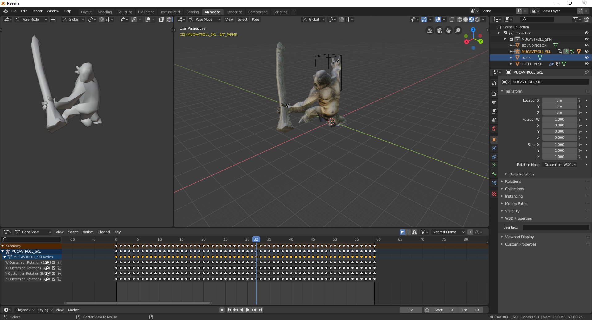

As we've already announced in our latest post, we're working on a **W3D Blender Plugin**. We strongly believe that modding is a big part of SAGE being such a succesful engine over the years, that's why we want to contribute tools back to the community.

You probably already know that the Westwood 3D (W3D) format is the 3D format used in the first games that were created with the SAGE engine (later on replaced by a serialized version called W3X). One big issue with that format used to be that there are very little tools that allow authoring of these files. The offical modding SDKs contained plugins for old Autodesk 3dsmax versions (which were recent at the time). The issue is that Autodesk 3dsmax is a commercial tool and the offical plugin is not available for current versions anymore. Apart from this it was lacking some features the community desperatly needs, like the import of compressed animations.

As a conclusion of this we decided to write an opensource Blender Plugin, which allows to export and import W3D files. Our existing W3D code from OpenSage was a big advantage, since it helped us getting a strong understanding of the format itself.

# Why Blender

With the latest major Blender 2.8 release it became the first choice for opensource modelling software. Big companies like Epic, NVIDIA, AMD and Ubisoft have decided to fund the development of Blender. Due to the open Python API documentation it's also easy to write plugins that interact with the software.

# How it works

*This walkthrough assumes you know how Blender works and how to use it*

As a user of the plugin you just want to install the latest version of the plugin, which can be found [here](https://github.com/OpenSAGE/OpenSAGE.BlenderPlugin/releases). Through the preferences window you can select that zip archive to be installed. The import and export submenus now contain entries for the `*.w3d` format.
During import of a model it's important that all referenced files (Skeleton & Textures) can be found, so they must be in the same folder as the file you want to import.

## General

So at first we'll start by importing a simple structure, like the Gondor Barracks from Battle for Middleearth:

The model as you can see it in the screenshot above is in it's default state. As you can see in the scene collection on the right we create a parent collection for all meshes that are part of the `W3D` file. Since materials in Blender 2.8 are completly node based the plugin automatically creates a node based shader setup that matches the material specified inside the model. See below for the barracks shader node setup, which uses a diffuse and normal texture.

Since there are many material options, which are specific to `W3D` we added two new property groups to the material section of each object. This groups are required to set advanced options of the Westwood3D format, which are quite specific to the SAGE game engine. So these options are only used for export again and have no effect in Blender itself.

## Skinned models

Let's continue by importing a simple skinned model, like the Cave Troll from Battle for Middleearth:

So let's take a closer look on what happened here. During import the skeleton is automatically loaded and applied to the mesh (in the scene collection it's named `MUCAVTROLL_SKL`). The pose that you can now see is the so called **Rest Pose**, which means that no animations are applied to the hierarchy.

## Animation

If we want to add an animation we need to load the according animation file, e.g. the attack animation (`mucavtroll_atkg.w3d`). The animation is automatically applied to the base model of the troll. Unfortunaly there is a keyframe create for each frame in most cases due to the animation compression technique used in W3D.

## Export

Exporting W3D models is a tricky part since meshes, skeletons and animations should get split in seperate files. During export the user must configure the export options accordingly.

## Render

Another cool usage of Blender is of course that it has great render capabilities itself, so this plugin could also be used for this purpose.

    <iframe width="560" height="315" src="https://www.youtube.com/embed/qazn4JlNm3Q" frameborder="0" gesture="media" allow="encrypted-media" allowfullscreen></iframe>

We are happy to hear your feedback for the new Blender W3D plugin!
