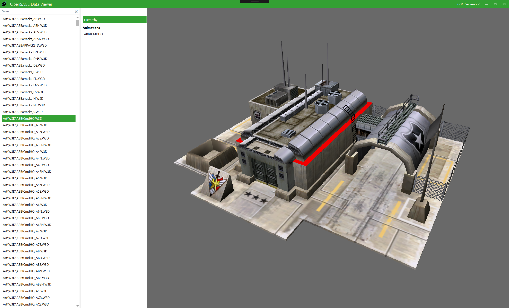

_[This post](http://timjones.io/blog/archive/2017/12/03/opensage-dev-diary-2017-12-03) was originally published on Tim's blog._

This is the first in what I hope will be a continuing series of updates on [OpenSAGE](https://github.com/OpenSAGE/OpenSAGE), my C&C Generals re-implementation project.

I've been working on OpenSAGE for about 6 months now. I'm still working on parsing and rendering the basic data files (3D models, maps, etc.). There isn't yet any playable executable. Instead, there's a "Data Viewer" application, which lists all the files found in the Generals (or Zero Hour) installation folder, and lets you view these files. I've found this approach helpful while writing parsers for the various file formats found in Generals. At some point, I'll transition to working on gameplay, and start to build up a playable executable.

Here is what the data viewer looks like. Here I'm viewing the USA Command Center 3D model:

I meant to start writing about this project soon after I started it, but clearly that didn't happen. Instead of trying to list everything I've done in the last 6 months, I'll just start from a week ago, and then try to keep up-to-date from now.

## Progress this week

This week, I have:

- Switched from a D3D12 renderer to a D3D11 renderer. I started out with a Direct3D 12 renderer because I wanted to learn Direct3D 12. Having done that, I realise it's not sensible for this particular project to require an API that only works on Windows 10. Direct3D 11 works on Windows 7 and above, and since many people are still on Windows 7, that's a better minimum requirement. I plan to add a Metal renderer (for macOS and iOS), and possibly Vulkan (for Android), depending on how popular this project is.
- In order to render the terrain and 3D meshes, I was previously relying on a D3D12-only feature called dynamic texture indexing. This allowed me, for example when rendering a map, to put all the terrain textures in a big array and send that to the GPU, and the pixel shader could dynamically index the right texture. Dynamic texture indexing of an array of textures (i.e. `Texture2D[]`) isn't supported in D3D11, so I instead used D3D11's closest equivalent, a texture array (`Texture2DArray`).
- `Texture2DArray` requires all the textures in the array to have the same size and format (unlike `Texture2D[]`, where textures can have arbitrary sizes and formats). The terrain textures used in Generals maps are not all the same size. There are 4 possible sizes: 64x64, 128x128, 256x256, and 384x384. In order to put all these into a `Texture2DArray`, I had to upsample the smaller textures to 384x384. Not a perfect solution, but it was the least bad option I could think of, while keeping the nice ability to render an entire terrain patch with a single draw call.
- Added a friendlier resource binding API. Previously, to set shader resources, I had to hard-code the resource slot in my C# code. Now I can use the name of the resource, as declared in HLSL, and using shader reflection I can match this to the resource slot.
- Added a stub for a Bink video parser. Currently I can parse the container format, but not yet any of the video or audio packets. Cinematic videos in Generals use the Bink video format (stored in `.bik` files), and up to now I've had a prototype Bink viewer that uses [FFmpeg](https://www.ffmpeg.org/) to play them. I'm toying with the possibility of implementing a Bink parser and renderer completely in C#, to remove the FFmpeg dependency. Native dependencies cause all sorts of headaches for cross-platform deployments, so I'd like to avoid them if I can. That said, Bink is not a simple format, so it might turn out to be a bad idea to try to implement it myself.
- Fixed some memory leaks. I noticed, when shutting down the data viewer app, that Direct3D complained in the Visual Studio output window about unreleased live resources. I tracked these down to a place where I'd forgotten to dispose some D3D objects.
- Abstracted the material system to support shader materials. 3D models in Generals and Zero Hour all use vertex materials, which were built on D3D8's fixed-function pipeline. Later SAGE games (Battle for Middle-earth II, C&C3, RA3) use shaders. I wanted to support both types of rendering early on, so that I don't need to do lots of refactoring later. Model rendering can now use either `FixedFunctionMaterial` (which still uses shaders, but it emulates a Generals-era fixed-function pipeline) or `ShaderMaterial`.

So, lots of refactoring and internal changes this week.

Next week I plan to work on the GUI. I have a prototype GUI renderer, built on WPF. I plan to rip this out and build a new one based on lower-level drawing APIs (Direct2D on Windows, and later, `CGContext` on macOS and iOS). Stay tuned!

Although I haven't done any work on maps this week, allow me to finish with a screenshot showing the current state of map rendering:

