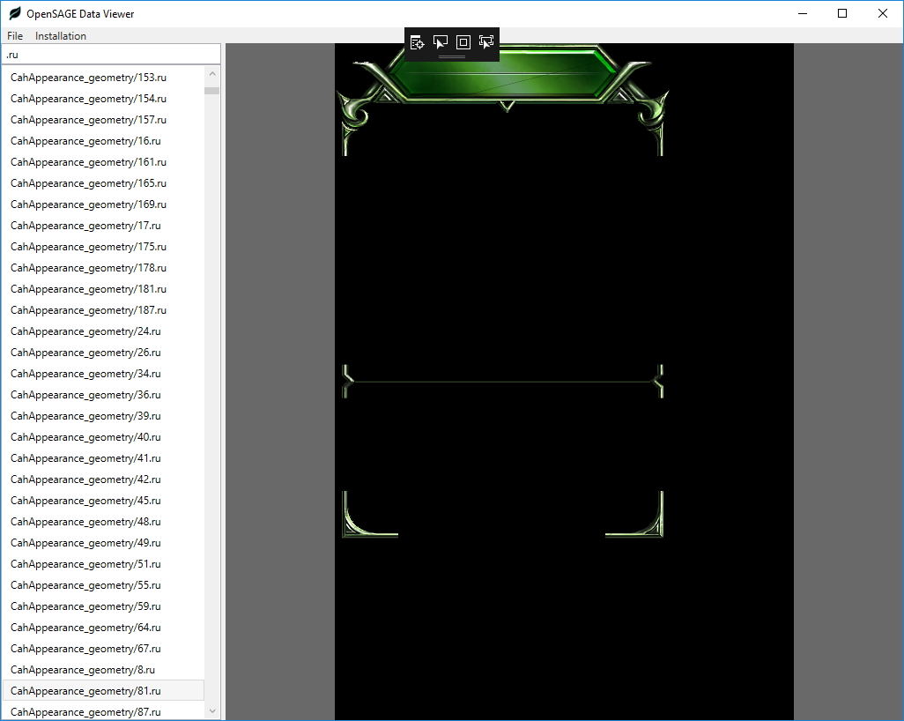

_[This post](http://timjones.io/blog/archive/2018/01/07/opensage-dev-diary-5) was originally published on Tim's blog._

*OpenSAGE is an open-source re-implementation of the [SAGE game engine](https://en.wikipedia.org/wiki/SAGE_(game_engine)). SAGE was the game engine used in C&C Generals, C&C Generals Zero Hour, Battle for Middle-earth and its sequels, C&C 3 and its sequel, and Red Alert 3 and its sequel. I've been working on OpenSAGE for 6 months, and made some good progress, so I've started this series of blog posts to talk about what is happening in the project each week. You can also star or watch the [OpenSAGE GitHub repo](https://github.com/OpenSAGE/OpenSAGE) for a more real-time view of things.*

Following on from [the previous post](/blog/archive/2017/12/24/opensage-dev-diary-4-2017-12-24), here is what's been happening this week in [OpenSAGE](https://github.com/OpenSAGE/OpenSAGE).

## Progress this week

The last two weeks have been exciting ones for the OpenSAGE project. For the first time, as much has been done by other contributors as by me, which marks an exciting turning point for the project.

This week's contributors (other than me):

* [Stephan Vedder](https://github.com/feliwir)
* [Paavo Huhtala](https://github.com/paavohuhtala)

In the last two weeks:

* Paavo [fixed parsing of floating-point values in .ini files for locales with decimal separators other than "."](https://github.com/OpenSAGE/OpenSAGE/pull/13), and [fixed a related issue](https://github.com/OpenSAGE/OpenSAGE/pull/24).

* Paavo [fixed .wnd controls that have a null header template](https://github.com/OpenSAGE/OpenSAGE/pull/14).

* I [simplified the render pipeline](https://github.com/OpenSAGE/OpenSAGE/commit/61994bee78f963a40eb4fea2c86c8113ceef78ab), because it was getting unnecessarily complex.

* Paavo [added support for the Origin version of Zero Hour's registry key](https://github.com/OpenSAGE/OpenSAGE/pull/15).

* Paavo [created an Xunit test discoverer to allow skipping of tests that depend on games that aren't currently installed](https://github.com/OpenSAGE/OpenSAGE/pull/16).

* I parsed BFME I and BFME II `.map` files. It turned out there were lots of new and modified chunks for these games: `CameraAnimationList`, `EnvironmentData`, `LibraryMapLists`, `MPPositionList`, `NamedCameras`, `PolygonTriggers`, `PostEffectsChunk`, `RiverAreas`, `SkyboxSettings`, `StandingWaterAreas`, `StandingWaveAreas`, and `Teams`. There aren't any existing specifications for these chunks so I had to figure them out by hand. BFME scripts have a few new fields, like `Enabled` and `Inverted` and some related to sequential scripts. There's a problem with terrain tile texture blending in BFME maps that I still need to fix, as you can see this in screenshot:

  

* Stephan [fixed .dds and .tga previews in the Data Viewer](https://github.com/OpenSAGE/OpenSAGE/pull/20).

* Paavo [fixed a crash in the Data Viewer that occurred when switching between different assets](https://github.com/OpenSAGE/OpenSAGE/pull/21).

* Paavo [fixed a bug in the Z positioning of some map objects](https://github.com/OpenSAGE/OpenSAGE/pull/23).

* Paavo [fixed / implemented a number of things related to loading campaign maps](https://github.com/OpenSAGE/OpenSAGE/pull/29).

* Stephan [implemented a viewer for .ru files](https://github.com/OpenSAGE/OpenSAGE/pull/28). `.ru` files store the raw geometry for APT UI screens, and this was a major stepping stone to the APT implementation that Stephan is continuing to work on.

  

* I parsed more BFME `.ini` files. These are obviously not required for Generals, but I find it helpful to get a detailed overview of  other SAGE games, so I can better design some of the engine abstractions.

* Stephan [updated the Xunit NuGet package](https://github.com/OpenSAGE/OpenSAGE/pull/38) - a small but nice bit of maintenance that makes tests run more reliably.

* Paavo [added a project for the game executable](https://github.com/OpenSAGE/OpenSAGE/pull/35). This is the start of something that will eventually be *the* way to play games using OpenSAGE. For now, it launches the Generals main menu with the background scene ("shell map") underneath.

  <blockquote class="twitter-video" data-lang="en">
Something pretty experimental... <a href="https://twitter.com/hashtag/OpenSAGE?src=hash&amp;ref_src=twsrc%5Etfw">#OpenSAGE</a> <a href="https://t.co/6IOaAWTbLY">pic.twitter.com/6IOaAWTbLY</a>
&mdash; Paavo Huhtala (@paavohtl) <a href="https://twitter.com/paavohtl/status/948352514814038016?ref_src=twsrc%5Etfw">January 3, 2018</a></blockquote>

* I started a refactoring of OpenSAGE's scene framework. Up to now I have been using a simplified version of Unity's `GameObject` / `Component` model, but this doesn't really match how SAGE originally worked. So I'm changing things about a bit, in order to provide a simpler and more stable foundation going forwards.

In non-development news, we now have an [OpenSAGE Discord server](https://discord.gg/G2FhZUT). Follow that invitation link to join. We're already having lots of lively discussions, so if you're at all interested in SAGE games or the OpenSAGE project, please join us.

I also found a mention of OpenSAGE on a [Russian C&C website](http://www.cncseries.ru/opensage/), which is pretty cool. Considering how little effort I've put into spreading the word, it's nice to see that people are hearing about it.

That's all for this time - until next week!