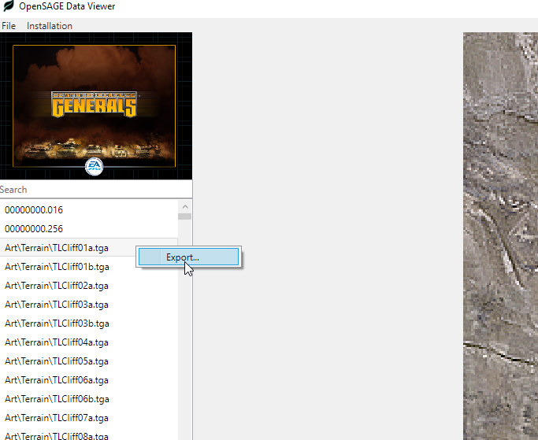

_[This post](http://timjones.io/blog/archive/2018/02/10/opensage-dev-diary-6-and-first-release) was originally published on Tim's blog._

*OpenSAGE is an open-source re-implementation of the [SAGE game engine](https://en.wikipedia.org/wiki/SAGE_(game_engine)). It is not affiliated with EA in any way. SAGE was the game engine used in C&C Generals, C&C Generals Zero Hour, Battle for Middle-earth and its sequels, C&C 3 and its sequel, and Red Alert 3 and its sequel. I've been working on OpenSAGE for 6 months, and made some good progress, so I've started this series of blog posts to talk about what is happening in the project each week. You can also star or watch the [OpenSAGE GitHub repo](https://github.com/OpenSAGE/OpenSAGE) for a more real-time view of things.*

## An anniversary

15 years ago today - on February 10th, 2003 - one of my favourite games, [Command & Conquer: Generals](https://en.wikipedia.org/wiki/Command_%26_Conquer:_Generals), was released. I was at university at the time. I don't remember if I bought it on launch day, or a few days after, but I do remember being excited to bring the game
home from the shop (because that was a thing we did in those days) and play it. I'd been a big fan of the Westwood era of C&C games, but the screenshots on the back
of this box looked like something different and exciting.

Long story short, I ploughed a vast number of hours into C&C Generals, and its sequel released later that year, Zero Hour. I was never a particularly good player,
but that didn't matter to me. I remember epic LAN games with two of my then-housemates, where the tide of war would ebb and flow to the accompaniment of commentary shouted between rooms.

So today, 15 years later, seems like an appropriate day for the first OpenSAGE release.

## Release 20180210

The very first release of OpenSAGE - catchily named 20180210 - is now available for download. [Grab it here](https://github.com/OpenSAGE/OpenSAGE/releases/tag/release-20180210)!

    <iframe width="560" height="315" src="https://www.youtube.com/embed/pFLK_DQXzp0" frameborder="0" gesture="media" allow="encrypted-media" allowfullscreen></iframe>

First, some caveats. This is a *very* early preview, representing the current state of the OpenSAGE project. It is nowhere near playable. There are number of lower-level elements in place - model rendering, map rendering, some menus - and these work quite well already. But we haven't yet started on gameplay.

This first release contains two separate applications: a "Data Viewer" and a "Launcher". The launcher is shown in the video above. The video shows basically everything that the launcher can currently do - which, if you look carefully, is actually quite a lot. It can load and render the shell map, load and render 3D models on the map, load and render the main menu, and handle transitions between menus.

The Data Viewer can preview files (including 3D models, maps, .ini files, and more) from any SAGE-based games that you have on your computer. We are using it as a development tool, but it may well be of interest to modders and anybody curious about how RTS games are built.

It's probably not worth logging issues on GitHub yet, because it's so early in development. Nothing works, except for the stuff that does. But if you're pretty sure that you've found a bug in something that *should* work, then feel free to [log an issue](https://github.com/OpenSAGE/OpenSAGE/issues).

## Progress since the last dev diary

A huge amount has happened to OpenSAGE since the [the previous dev diary](/blog/dev-diary-5):

* I implemented cloud shadows and macrotextures in the terrain renderer. These are quite subtle effects, but obvious when they're removed. Unlike the original Generals game, OpenSAGE's cloud shadows apply to objects too!

    <iframe width="560" height="315" src="https://www.youtube.com/embed/_QM3T_zU66E" frameborder="0" gesture="media" allow="encrypted-media" allowfullscreen></iframe>

* [Stephan](https://github.com/feliwir) did a lot of great work on the ActionScript interpreter that lies at the heart of the APT runtime. APT is the GUI framework used in BFME and later games. The main menu from BFME II now loads and partially runs, although there's plenty left to do:

    <iframe width="560" height="315" src="https://www.youtube.com/embed/Lo1iqrUP6GQ" frameborder="0" gesture="media" allow="encrypted-media" allowfullscreen></iframe>

* [Paavo](https://github.com/paavohuhtala) snuck in an Export feature to the Data Viewer at the last minute:

  

We've also made many lower-level changes:

* Moved from a custom rendering backend to [Veldrid](https://github.com/mellinoe/veldrid). This will allow us to make OpenSAGE cross-platform.
* Moved windowing to SDL2 - also with the aim of making OpenSAGE cross-platform.
* Fixed some memory leaks in the Data Viewer.
* Refactored the scene structure to make more sense.
* Paavo implemented object collision. This can be seen when viewing a map in the Data Viewer - if you click on an object, it will shrink, which is an amusing but obviously temporary way to test the collision system.
* Paavo optimised particle systems, such that they don't allocate any memory on the heap in their per-frame update.
* Paavo created separate C# projects for each SAGE game. This will help us keep game-specific code out of the core engine.
* Paavo rewrote the map scripting system, and implemented many more script actions and conditions.
* Paavo implemented more .wnd callbacks, which means more of the main menu works.
* Added initial support for the .manifest / .relo / .imp / .bin file system used in C&C3 and above.
* Parsed the .map format for C&C3, RA3, and C&C4.

## Onwards...

I hope you'll [give OpenSAGE a try](https://github.com/OpenSAGE/OpenSAGE/releases/tag/release-20180210) - if you do, please let me know your thoughts and feedback in the comments below.