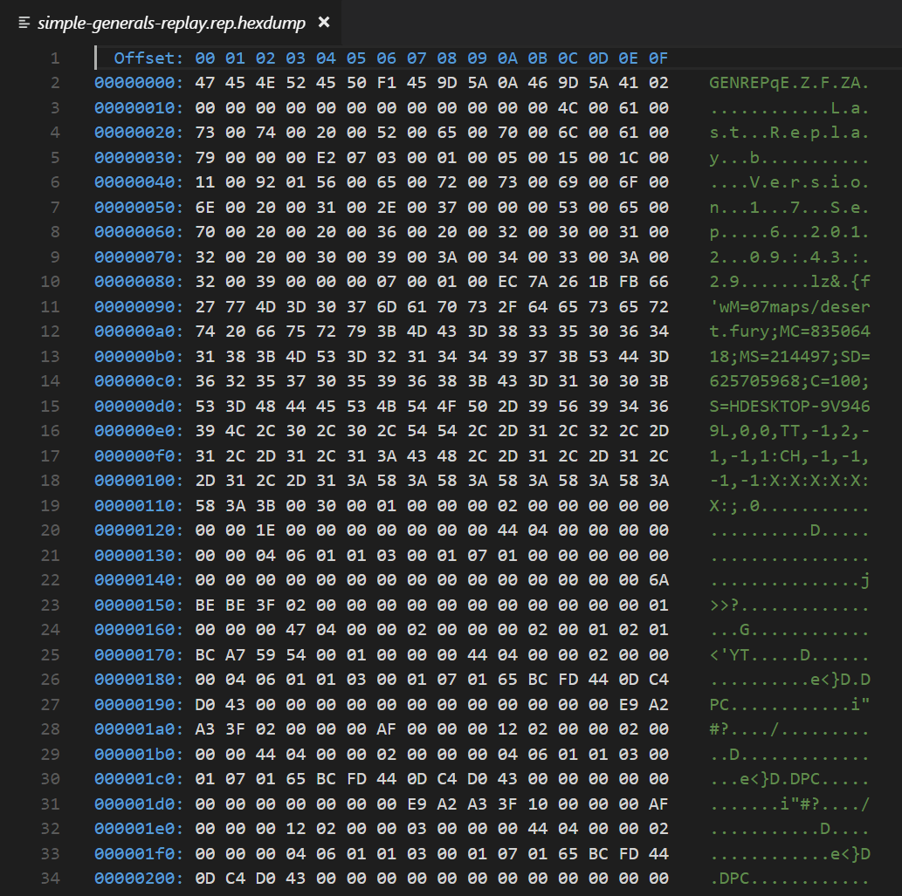

_[This post](http://timjones.io/blog/archive/2018/03/06/parsing-command-and-conquer-generals-replay-files) was originally published on Tim's blog._

**TL/DR: In this post we'll examine C&C Generals replay (.rep) files in detail, figure out how they work, and then look at a very early implementation of a replay viewer that I've added to [OpenSAGE](https://github.com/OpenSAGE/OpenSAGE).**

Have you ever saved a replay from [insert your favourite video game here], and wondered exactly what the replay file contains? I don't know how many people will answer "yes" to that question, but I'm one of them. For efficiency and IP-protection reasons, replay files are usually stored in a binary format, so if you open one of them in Notepad, all you'll see are a bunch of garbled characters. It's often a long road from there, to fully understanding and being able to parse one of these files.

One of the features I hope to support in [OpenSAGE](https://github.com/OpenSAGE/OpenSAGE) is being able to use replay files from the original Command & Conquer: Generals and Zero Hour games. Since no official description of Generals' replay file format has been published, I have to do it the hard way, and figure out the file format... but fortunately, I'm not the first to want to do this.

I should note here that replay files vary wildly between games, so what applies to one specific RTS game won't apply directly to other games, but the general principles should be similar, at least across RTS games.

Before we get into the details, let's start with the fun part: creating a replay file in the first place.

## Creating a replay file

Let's load C&C Generals, and play a quick skirmish game. For the purposes of this blog post, I want to keep the replay file *really* simple, so all I'll do is start a single-player skirmish game, build one building, and exit. Here's what that looks like:

<div class="video-responsive">
    <iframe width="560" height="315" src="https://www.youtube.com/embed/Nv0NdiYz1fA" frameborder="0" gesture="media" allow="encrypted-media" allowfullscreen></iframe>
</div>

Here's the replay file that Generals saved for that game:

* [simple-generals-replay.rep](/assets/replay-parsing/simple-generals-replay.rep)

## First look

If we open that replay file in VSCode using the excellent [hexdump](https://marketplace.visualstudio.com/items?itemName=slevesque.vscode-hexdump) extension, we'll see this:



You can immediately see some human-readable text there. That's always nice to see, when you're parsing an unknown binary format.

It was at this point, when I first looked at Generals' replay files, that I wondered whether anybody else had figured out the file format before. So I Googled and found [the cnc-replayreaders repo on GitHub](https://github.com/louisdx/cnc-replayreaders), which contains at least *some* work on parsing replay files for many SAGE games, including, happily, C&C Generals. Without this information, proceeding further would have been much harder. [Here's the C++ code for a prototype version of a Generals replay parser](https://github.com/louisdx/cnc-replayreaders/blob/master/ccgzhreader.cpp). There's even a [document with the beginnings of a spec for these replay files](https://github.com/louisdx/cnc-replayreaders/blob/master/eareplay.html). This is great stuff! Many thanks to [louisdx](https://github.com/louisdx), who I believe also goes by the name [R Schneider on gamereplays.org](https://www.gamereplays.org/community/index.php?s=82acbb27d5c639b8dc4210422352778b&showuser=122871). I'll duplicate the Generals part of it here:

> ### Generals, Zero Hour, Battle for Middle Earth, Rise of the Witch King
> The replay format of the games *Generals*, *Zero Hour*, *Battle for Middle Earth*, *Battle for Middle Earth 2*, and its expansion *Rise of the Witch King* is considerably simpler than that of the later games. Most notably, the chunks do not have length information, so one must know their sizes by other means. Also, there is no footer, just a final chunk.
> #### Header
> The size `u1` is 12 for *Generals* and *Zero Hour*, and 21 in the BfME games; `u2` is 8 in CCG/ZH and 13 in the BfME games; `u3` is 4 except in BfME2, where it is 6.
> ``` c
> char             str_magic[6/8];     // == "GENREP", "BFMEREPL" or "BFME2RPL"
> uint32_t         timestamp_begin;
> uint32_t         timestamp_end;
> byte             unknown1[u1];
> tb_str           str_filename;
> tb_ch            date_time[8];       // as in TW/KW
> tb_str           str_version;
> tb_str           str_build_date;
> uint16_t         version_minor;
> uint16_t         version_major;
> byte             magic_hash[u2]
> char             header[];           // null-terminated!
> uint16_t         unknown2;
> uint32_t         unkonwn3[u3];
> ```
> **Remarks.** The two timestamps appear to indicate the real-world start and end time of the game. The `header` is of the same format as the later games.
> #### The replay body
> The replay body consists of a sequence of *chunks*. Each chunk is of the following form:
> ``` c
> uint32_t         time_code;
> uint32_t         chunk_code;
> uint32_t         number;         // Player number?
> byte             number_of_commands;
> struct { byte cmd, byte nargs } signature[number_of_commands];
> byte             arguments[];    // variable!
> ```
> In the simplest case, `number_of_commands` is zero and `signature` and `arguments` are empty. Otherwise, there are `number_of_commands` many pairs of bytes {`cmd`,`nargs`}, where `cmd` refers to one of about ten commands and `nargs` is the number of arguments. The size of an argument depends on the command type. Finally, `arguments`  consists of all the arguments of all the commands, simply one after the other.
> The meaning of the chunk codes is unknown in general. Only a handful of values seem to occur, all in the range 0x300 - 0x500, and 0x1B, 0x1D. Many codes only ever seem to appear with a fixed, specific signature of commands.
> These are the known commands and their argument sizes.
> <div class="table-wrapper">
>
> | command | argument size (bytes) | Description/Notes              |
> |---------|-----------------------|--------------------------------|
> | 0x00    | 4                     | ?                              |
> | 0x01    | 4                     | ?                              |
> | 0x02    | 1                     | ?                              |
> | 0x03    | 4                     | ?                              |
> | 0x04    | 4                     | ?                              |
> | 0x06    | 12                    | 3 uint32\_t's? 1 long double?  |
> | 0x07    | 12                    | 3 uint32\_t's? 1 long double?  |
> | 0x08    | 16                    | 4 uint32\_t's?                 |
> | 0x09    | 4/16                  | 4 bytes in BFME2, 16 otherwise |
> | 0x0A    | 4                     | 4 uint32\_t's?                 |
>
> </div>
> There is no footer. The final chunk has `number_of_commands` set to zero, and it appears to have command code 0x1B or 0x1D.

## Parsing the header

Armed with that information, let's get started with parsing the header. I'll use C# here, because that's what we're using in the [OpenSAGE](https://github.com/OpenSAGE/OpenSAGE/tree/master/src/OpenSage.Game/Data/Rep) project, but really any language that gives you the ability to read from a byte stream will work.

Before we can parse anything, we need to open a `BinaryReader` for the replay file:

``` csharp
using (var stream = File.OpenRead("simple-generals-replay.rep"))
using (var reader = new BinaryReader(stream, Encoding.Unicode, true))
{
    // TODO: Parse header
    // TODO: Parse body
}
```

Now we can parse the header, based on the description above. I've commented most lines with the actual values from our sample replay file.

``` csharp
string magic;
using (var asciiReader = new BinaryReader(stream, Encoding.ASCII, true))
{
    magic = asciiReader.ReadFixedLengthString(6); // "GENREP"
}

var origin = new DateTime(1970, 1, 1, 0, 0, 0, 0, DateTimeKind.Utc);
DateTime readTimestamp(BinaryReader reader) => origin.AddSeconds(reader.ReadUInt32());

var timestampBegin = ReadTimestamp(reader); // "2018-03-05 1:28:17 UTC"
var timestampEnd = ReadTimestamp(reader);   // "2018-03-05 1:28:42 UTC"

var numTimecodes = reader.ReadUInt16(); // "577"

var unknown1 = reader.ReadBytes(12); // Sometimes all zeros, and sometimes not

var filename = reader.ReadNullTerminatedString(); // "Last Replay"

var dateTime = ReplayTimestamp.Parse(reader); // "2018-03-05 21:28:17.402 Monday"

var version = reader.ReadNullTerminatedString(); // "Version 1.7"
var buildDate = reader.ReadNullTerminatedString(); // "Sep  6 2012 09:43:29"

var versionMinor = reader.ReadUInt16(); // 7
var versionMajor = reader.ReadUInt16(); // 1

var magicHash = reader.ReadBytes(8); // 236, 122, 38, 27, 251, 102, 39, 119

var metadata = reader.ReadNullTerminatedAsciiString(); // "M=07maps/desert fury;MC=83506418;MS=214497;SD=625705968;C=100;S=HDESKTOP-9V9469L,0,0,TT,-1,2,-1,-1,1:CH,-1,-1,-1,-1:X:X:X:X:X:X:;"

var unknown2 = reader.ReadUInt16(); // "48"

var unknown3 = reader.ReadUInt32(); // "1"
var unknown4 = reader.ReadUInt32(); // "2"
var unknown5 = reader.ReadUInt32(); // "0"

var gameSpeed = reader.ReadUInt32(); // "30"
```

So, the header spec in the [cnc-replayreaders project](https://github.com/louisdx/cnc-replayreaders/blob/master/eareplay.html) looks pretty accurate. I've worked out that one of the unknowns is the game speed. I don't know about the others, but by comparing enough replays with known game states, it should be possible to work them out.

This already gives us quite a lot of interesting data, such as the map, player details, start and end times, and even the date that the version of Generals that I'm using was compiled (September 6th 2012, apparently).

This is all very well, but what I'm really interested in is the actual replay data.

## Parsing the body

There are many ways game replay data can be saved. If there aren't too many "things" in the world to keep track of, you could store the entire state of the world at every timestep. For RTS games with potentially hundreds or thousands of units, this wouldn't scale - and so these games usually only save player inputs, and use those inputs to recreate the entire simulation. (This is also why you often can't rewind replays; you'd have to start from the beginning again, and simulate every frame up to the one you're interested in, in order to get the correct state for that frame.)

Knowing that, what I'm expecting to see in the body of the replay file is a sequence of commands (or "orders", as I've chosen to call them), roughly corresponding to the actions I performed in the game. For example, "select unit" and "create power plant". Each of those orders would have arguments relevant to the order type. For example, "select unit" would have some sort of identifier to store which unit was selected.

There may be (and in fact, are) some orders that weren't triggered by me, such as an "end game" order - anything that the game can't recreate by itself needs to be saved in the replay file.

Fortunately for us, the cnc-replayreaders spec appears to match this concept, so we're on the right track. It looks like a "chunk" is probably a single order, and every order has 0 or more arguments.

The body of a replay file is composed of `n` chunks. There's no way to know how many chunks there are from the header - after reading the header, you just have to keep reading chunks until you get to the end of the file. Like this:

``` csharp
while (reader.BaseStream.Position < reader.BaseStream.Length)
{
    // TODO: Parse chunk
}
```

Let's look at the basic structure of a chunk. Then we can impose that structure onto our sample replay file and see what we get.

Let's use the description quoted above, and convert it into the code to parse a chunk header:

``` csharp
var timecode = reader.ReadUInt32(); // 0-based timecode
var orderType = reader.ReadUInt32AsEnum<OrderType>(); // See below
var number = reader.ReadUInt32(); // 0-based index of this chunk

var numUniqueArgumentTypes = reader.ReadByte(); // Number of unique argument types

// Pairs of {argument type, count}.
var argumentCounts = new (OrderArgumentType argumentType, byte count)[numUniqueArgumentTypes];
for (var i = 0; i < numUniqueArgumentTypes; i++)
{
    // Read the number of arguments for this argument type.
    argumentCounts[i] = (reader.ReadByteAsEnum<OrderArgumentType>(), reader.ReadByte());
}

// TODO: Read argument data
```

We don't know what `orderType` means yet; we'll have to look at the chunks, once we've parsed them, and make some guesses. We'll do that below.

`argumentCounts` stores the number of arguments *for each argument type*. So there might be 2 integer arguments, 1 boolean argument, and 1 float argument, for example. We can calculate the total number of arguments by summing the counts of each argument type.

Our first order of business is working out how many bytes each argument value uses, because without knowing that, we don't know where the next chunk starts.

There's nothing in the chunk header that directly tells us how big the argument data array is. We need to derive it from the number and type of arguments. I worked out the argument types from looking at a few replay files in a hex viewer and making some educated guesses. This fills in the gaps in the table of commands that I quoted above. Here's what I've found so far, although I'm sure there are more:

``` csharp
enum OrderArgumentType : byte
{
    Integer = 0,       // int32 (4 bytes)
    Float = 1,         // float32 (4 bytes)
    Boolean = 2,       // bool (1 byte)
    ObjectId = 3,      // uint32 (4 bytes)
    Position = 6,      // float32 * 3 (12 bytes)
    ScreenPosition = 7 // int32 * 2 (8 bytes)
}
```

Now we can write the code to parse order arguments. Note that, to keep things simple, I'm not doing anything with the parsed variables, but [in the real code](https://github.com/OpenSAGE/OpenSAGE/blob/6887852b18b51c08359b7cc03634a4e02218741f/src/OpenSage.Game/Data/Rep/ReplayChunk.cs#L37) I do.

``` csharp
for (var i = 0; i < numUniqueArgumentTypes; i++)
{
    ref var argumentCount = ref argumentCounts[i];
    var argumentType = argumentCount.argumentType;

    for (var j = 0; j < argumentCount.count; j++)
    {
        switch (argumentType)
        {
            case OrderArgumentType.Integer:
                var i = reader.ReadInt32();
                break;

            case OrderArgumentType.Float:
                var f = reader.ReadSingle();
                break;

            case OrderArgumentType.Boolean:
                var b = reader.ReadBooleanChecked();
                break;

            case OrderArgumentType.ObjectId:
                var oi = reader.ReadUInt32();
                break;

            case OrderArgumentType.Position:
                var p = reader.ReadVector3();
                break;

            case OrderArgumentType.ScreenPosition:
                var sp = reader.ReadPoint2D();
                break;

            default:
                throw new InvalidOperationException();
        }
    }
}
```

Armed with all that code, we can finally parse our sample replay file. Let's do that, and write out all the replay chunks from our sample replay file. I've trimmed it down, because the replay file contains 733 lines - i.e. 733 orders - most of which are duplicate `1092` orders. I've marked the trimmed lines with "...".

<div class="table-wrapper">

| Timecode | OrderType | Number | Arg 1                            | Arg 2                              | Arg 3            | Arg 4          | Arg 5      | Arg 6                     | 
|----------|-----------|--------|----------------------------------|------------------------------------|------------------|----------------|------------|---------------------------| 
| 0        | 1092      | 0      | Position:<0, 0, 0>               | Float:0                            | Float:0          | Float:1.490186 | Integer:2  | ScreenPosition:<0, 0>     | 
| 1        | 1095      | 2      | Integer:431591478                | Boolean:False                      |                  |                |            |                           | 
| 1        | 1092      | 2      | Position:<443.9366, 1997.808, 0> | Float:0                            | Float:0          | Float:1.278409 | Integer:2  | ScreenPosition:<174, 521> | 
| 2        | 1092      | 2      | Position:<443.9366, 1997.808, 0> | Float:0                            | Float:0          | Float:1.278409 | Integer:16 | ScreenPosition:<174, 521> | 
| ...      |           |        |                                  |                                    |                  |                |            |                           | 
| 96       | 1092      | 2      | Position:<443.9366, 1997.808, 0> | Float:0                            | Float:0          | Float:1.278409 | Integer:13 | ScreenPosition:<470, 322> | 
| 97       | 1092      | 2      | Position:<443.9366, 1997.808, 0> | Float:0                            | Float:0          | Float:1.278409 | Integer:13 | ScreenPosition:<470, 324> | 
| 98       | 1003      | 2      | Boolean:True                     |                                    |                  |                |            |                           | 
| 98       | 1001      | 2      | Boolean:True                     | ObjectId:469                       |                  |                |            |                           | 
| 98       | 1092      | 2      | Position:<443.9366, 1997.808, 0> | Float:0                            | Float:0          | Float:1.278409 | Integer:2  | ScreenPosition:<470, 324> | 
| 99       | 1092      | 2      | Position:<443.9366, 1997.808, 0> | Float:0                            | Float:0          | Float:1.278409 | Integer:13 | ScreenPosition:<470, 324> | 
| 100      | 1092      | 2      | Position:<443.9366, 1997.808, 0> | Float:0                            | Float:0          | Float:1.278409 | Integer:13 | ScreenPosition:<470, 324> | 
| 101      | 1095      | 2      | Integer:1160876625               | Boolean:False                      |                  |                |            |                           | 
| 101      | 1092      | 2      | Position:<443.9366, 1997.808, 0> | Float:0                            | Float:0          | Float:1.278409 | Integer:13 | ScreenPosition:<470, 324> | 
| 102      | 1092      | 2      | Position:<443.9366, 1997.808, 0> | Float:0                            | Float:0          | Float:1.278409 | Integer:13 | ScreenPosition:<470, 324> | 
| ...      |           |        |                                  |                                    |                  |                |            |                           | 
| 199      | 1092      | 2      | Position:<443.9366, 1997.808, 0> | Float:0                            | Float:0          | Float:1.278409 | Integer:10 | ScreenPosition:<600, 292> | 
| 200      | 1092      | 2      | Position:<443.9366, 1997.808, 0> | Float:0                            | Float:0          | Float:1.278409 | Integer:10 | ScreenPosition:<600, 292> | 
| 201      | 1095      | 2      | Integer:-1950611085              | Boolean:False                      |                  |                |            |                           | 
| 201      | 1092      | 2      | Position:<443.9366, 1997.808, 0> | Float:0                            | Float:0          | Float:1.278409 | Integer:10 | ScreenPosition:<600, 292> | 
| 202      | 1092      | 2      | Position:<443.9366, 1997.808, 0> | Float:0                            | Float:0          | Float:1.278409 | Integer:10 | ScreenPosition:<600, 292> | 
| ...      |           |        |                                  |                                    |                  |                |            |                           | 
| 214      | 1092      | 2      | Position:<443.9366, 1997.808, 0> | Float:0                            | Float:0          | Float:1.278409 | Integer:10 | ScreenPosition:<600, 294> | 
| 215      | 1092      | 2      | Position:<443.9366, 1997.808, 0> | Float:0                            | Float:0          | Float:1.278409 | Integer:10 | ScreenPosition:<600, 294> | 
| 216      | 1049      | 2      | Integer:774                      | Position:<553.6661, 1923.072, 140> | Float:-0.7853982 |                |            |                           | 
| 216      | 1092      | 2      | Position:<443.9366, 1997.808, 0> | Float:0                            | Float:0          | Float:1.278409 | Integer:2  | ScreenPosition:<600, 294> | 
| 217      | 1092      | 2      | Position:<443.9366, 1997.808, 0> | Float:0                            | Float:0          | Float:1.278409 | Integer:13 | ScreenPosition:<600, 294> | 
| 218      | 1092      | 2      | Position:<443.9366, 1997.808, 0> | Float:0                            | Float:0          | Float:1.278409 | Integer:13 | ScreenPosition:<600, 294> | 
| ...      |           |        |                                  |                                    |                  |                |            |                           | 
| 299      | 1092      | 2      | Position:<443.9366, 1997.808, 0> | Float:0                            | Float:0          | Float:1.278409 | Integer:13 | ScreenPosition:<558, 297> | 
| 300      | 1092      | 2      | Position:<443.9366, 1997.808, 0> | Float:0                            | Float:0          | Float:1.278409 | Integer:13 | ScreenPosition:<543, 301> | 
| 301      | 1095      | 2      | Integer:752532121                | Boolean:False                      |                  |                |            |                           | 
| 301      | 1092      | 2      | Position:<443.9366, 1997.808, 0> | Float:0                            | Float:0          | Float:1.278409 | Integer:13 | ScreenPosition:<528, 304> | 
| 302      | 1092      | 2      | Position:<443.9366, 1997.808, 0> | Float:0                            | Float:0          | Float:1.278409 | Integer:13 | ScreenPosition:<517, 306> | 
| ...      |           |        |                                  |                                    |                  |                |            |                           | 
| 353      | 1092      | 2      | Position:<443.9366, 1997.808, 0> | Float:0                            | Float:0          | Float:1.278409 | Integer:13 | ScreenPosition:<403, 215> | 
| 354      | 1092      | 2      | Position:<443.9366, 1997.808, 0> | Float:0                            | Float:0          | Float:1.278409 | Integer:13 | ScreenPosition:<403, 215> | 
| 355      | 1003      | 2      | Boolean:True                     |                                    |                  |                |            |                           | 
| 355      | 1001      | 2      | Boolean:True                     | ObjectId:468                       |                  |                |            |                           | 
| 355      | 1092      | 2      | Position:<443.9366, 1997.808, 0> | Float:0                            | Float:0          | Float:1.278409 | Integer:2  | ScreenPosition:<403, 215> | 
| 356      | 1092      | 2      | Position:<443.9366, 1997.808, 0> | Float:0                            | Float:0          | Float:1.278409 | Integer:13 | ScreenPosition:<403, 215> | 
| ...      |           |        |                                  |                                    |                  |                |            |                           | 
| 399      | 1092      | 2      | Position:<443.9366, 1997.808, 0> | Float:0                            | Float:0          | Float:1.278409 | Integer:2  | ScreenPosition:<265, 509> | 
| 400      | 1092      | 2      | Position:<443.9366, 1997.808, 0> | Float:0                            | Float:0          | Float:1.278409 | Integer:2  | ScreenPosition:<265, 511> | 
| 401      | 1095      | 2      | Integer:1629276425               | Boolean:False                      |                  |                |            |                           | 
| 401      | 1092      | 2      | Position:<443.9366, 1997.808, 0> | Float:0                            | Float:0          | Float:1.278409 | Integer:2  | ScreenPosition:<265, 511> | 
| 402      | 1092      | 2      | Position:<443.9366, 1997.808, 0> | Float:0                            | Float:0          | Float:1.278409 | Integer:2  | ScreenPosition:<265, 511> | 
| ...      |           |        |                                  |                                    |                  |                |            |                           | 
| 475      | 1092      | 2      | Position:<443.9366, 1997.808, 0> | Float:0                            | Float:0          | Float:1.278409 | Integer:2  | ScreenPosition:<214, 493> | 
| 475      | 1092      | 2      | Position:<443.9366, 1997.808, 0> | Float:0                            | Float:0          | Float:1.278409 | Integer:2  | ScreenPosition:<214, 493> | 
| 475      | 27        | 2      |                                  |                                    |                  |                |            |                           | 
</div>

Let's try to figure out what each order type means:

* `1092`: It's not obvious in the trimmed version, but this order type appears the most times, *by far*. We see it has 6 arguments: a 3D position, 3 floats, 1 integer, and 1 2D position. If you load the map we used in World Builder (the Generals editing tool), you'll find that the 3D position in these orders corresponds with the map point at the centre of the screen. So it's very likely that `1092` is some sort of **set camera position** order. It's weird that Generals saves one of these for each timecode, even when the camera hasn't moved; the replay file would be much smaller if it only saved this order when the camera moved. The non-zero float argument might be field-of-view, and I don't yet know what the other arguments mean.
* `1095`: This appears exactly every 100 timecodes. It has 1 integer and 1 boolean argument. Based on what I know about how RTS games do lockstep networking, and seeing that the integer argument value varies wildly, I guess this is a **checksum** order, which instructs the game engine to check that its internal world representation is in sync with other network players. In this case, there are no network players, but for simplicity the game engine probably runs this code anyway. Incidentally, it's when this value doesn't match the game's computed state that you get the dreaded "game has detected a mismatch" error.
* `1003`, immediately followed by `1001`: This timecode corresponds to when I selected the dozer. So `1003` is probably **clear selection**, and `1001` is probably **set selection**. `1001` has an `ObjectId` argument, which would be the ID of the object that should be selected. [Jana Mohn](https://github.com/qibbi) helped me figure out that this is a runtime ID, with the index based on all the objects that have been loaded for the current map. As with many other aspects of replay files, only if the engine loads exactly the same things in exactly the same order, will it be able to successfully play a replay and get the same result.
* `1049`: This has 1 integer, 1 3D position, and 1 float argument. The timecode corresponds to when I told the dozer to build a power plant, so this is probably a **build object** order. The integer argument is some kind of ID representing the object to build - and with experimentation, I have discovered that it's an index into an array of all the `Object` definitions after they've been loaded from .ini files. The 3D position argument is where to build it, and the float argument is the angle at which to place the building.
* `27`: This is always the last order in a replay file, so it's some sort of **end game** order.

And that's it, for this simple replay file. Only 6 unique order types. Obviously in a full game, there would be many more order types, but this blog post is long enough already.

## In action

As I mentioned at the beginning, my motivation for parsing Generals replay files is being to play them in OpenSAGE. So, I implemented just enough in OpenSAGE to be able to parse and "play" this simple replay file, and here is the result. It's obviously extremely unfinished, but hopefully you can see the connection with the original replay. You can also see our work on the main menu, replay menu, map rendering, etc...

<div class="video-responsive">
    <iframe width="560" height="315" src="https://www.youtube.com/embed/XNP_DfLrVQw" frameborder="0" gesture="media" allow="encrypted-media" allowfullscreen></iframe>
</div>

The code for "playing" a replay iterates through the chunks, with the appropriate timing, and executes each chunk's order - for example, creating a building or setting the camera's position. There's a huge amount still to do. There are some mysteries that will have to be solved, such as the random number generator (RNG) used by Generals, so there are no guarantees that we'll really be able to do it - but if I worried too much about that, I wouldn't have started OpenSAGE in the first place. On the bright side, much of the code for running through a replay will carry over, as-is, to actually playing single-player and multi-player games.

## The end

Hopefully that gives a rough picture of how one goes about parsing a binary file format where you know roughly what it should contain, but you don't know the exact structure. Again, many thanks to louisdx for the [cnc-replayreaders project](https://github.com/louisdx/cnc-replayreaders). If I wasn't able to build on that existing knowledge, this would have been a lot more difficult.

Parsing of Generals .rep replay files [is implemented in OpenSAGE here](https://github.com/OpenSAGE/OpenSAGE/tree/master/src/OpenSage.Game/Data/Rep). If you're interested, you can browse the full code to see details I left out in this blog post.

If you're interested in what we're doing in OpenSAGE, [join our Discord server](https://discord.gg/G2FhZUT) and chat to us, we're quite friendly!