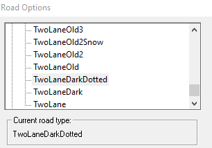
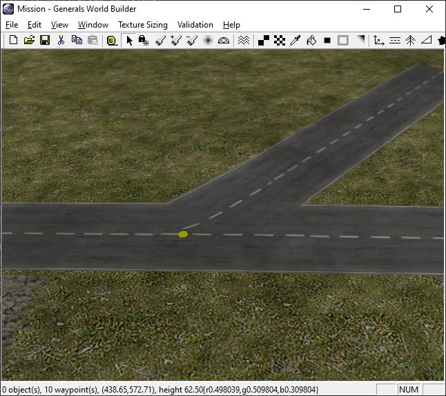

Figuring out how to render the roads correctly in OpenSAGE turned out to be a little more challenging than expected. Let's start by creating a map with a simple road network in World Builder.

## Creating a test map

We can create roads using the `Road` tool. First we have to select one of the predefined road types. 



Then we can create road segments by dragging the mouse from the start to the end point.


When two endpoints are moved close enough together, World Builder automatically connects the two segments and merges the endpoints into a single one. This allows us to create a connected graph with nodes and edges.


For each node, we can set the corner type, but it will only affect nodes with two edges.


If more than two edges are joined together, the node becomes a crossing and is rendered using a special texture:



## Inspecting the map file

Now that we finished our road network, let's save the map and see how all this information is stored in the map file...or rather, how it's _not_ stored. While we can observe the described behavior in Worldbuilder, the map file pretty much doesn't care about graphs, nodes or edges. There's simply a pair of map objects for each road segment. For our map above, it looks like this:

|Type|X|Y|RoadType|
|---|---|---|---|
|TwoLaneDarkDotted|191|412|Start|
|TwoLaneDarkDotted|346|410|End|
|||||
|TwoLaneDarkDotted|450|407|Start|
|TwoLaneDarkDotted|346|410|End|
|||||
|TwoLaneDarkDotted|471|540|Start|
|TwoLaneDarkDotted|346|410|End|
|||||
|TwoLaneOld2|288|288|Start \| TightCurve|
|TwoLaneOld2|182|289|End|
|||||
|TwoLaneOld2|288|288|Start \| TightCurve|
|TwoLaneOld2|291|393|End|

The `RoadType` is a bit field that contains information about whether this is a start or end point and about the curve type (the default is `BroadCurve`, whereas `TightCurve` and `Angled` have their own bits).

So...each road segment is represented by a pair of objects with their `RoadType` set to `Start` and `End`.

## Building the graph

In order to decide which textures we have to draw, we need to build a graph data structure using the following classes:

```csharp
internal sealed class RoadTopologyNode
{
    public Vector3 Position { get; }
    public List<RoadTopologyEdge> Edges { get; } = new List<RoadTopologyEdge>();

    // ...
}

internal sealed class RoadTopologyEdge
{
    public RoadTemplate Template { get; }

    public RoadTopologyNode Start { get; private set; }
    public RoadType StartType { get; private set; }

    public RoadTopologyNode End { get; private set; }
    public RoadType EndType { get; private set; }

    // ...
}
```

We do that by creating a _RoadTopologyEdge_ for every pair of points. For both endpoints, we either create a new _RoadTopologyNode_, or we reuse an existing one if we already created one at *exactly* the same location and with the same type (roads of different type are never connected):

```csharp
        public void AddSegment(RoadTemplate template, MapObject start, MapObject end)
        {
            var startNode = GetOrCreateNode(start.Position);
            var endNode = GetOrCreateNode(end.Position);

            if (endNode == startNode)
            {
                // ...
            }

            var edge = new RoadTopologyEdge(
                template,
                startNode,
                start.RoadType,
                endNode,
                end.RoadType,
                Edges.Count);

            Edges.Add(edge);

            startNode.Edges.Add(edge);
            endNode.Edges.Add(edge);
        }
```

Let's take a quick look at one of the road definitions:

```ini
Road TwoLaneDarkDotted
  Texture = TRTwoLane6.tga
  RoadWidth = 35.0
  RoadWidthInTexture = 0.9
End
```

The definition only references one texture file which contains the images for all the different road types, which are:
* Straight
* Broad curve
* Tight curve
* End cap
* Symmetric Y crossing
* Asymmetric Y crossing
* T crossing
* X crossing
