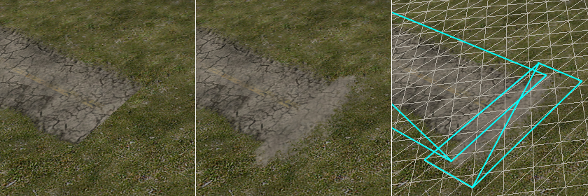
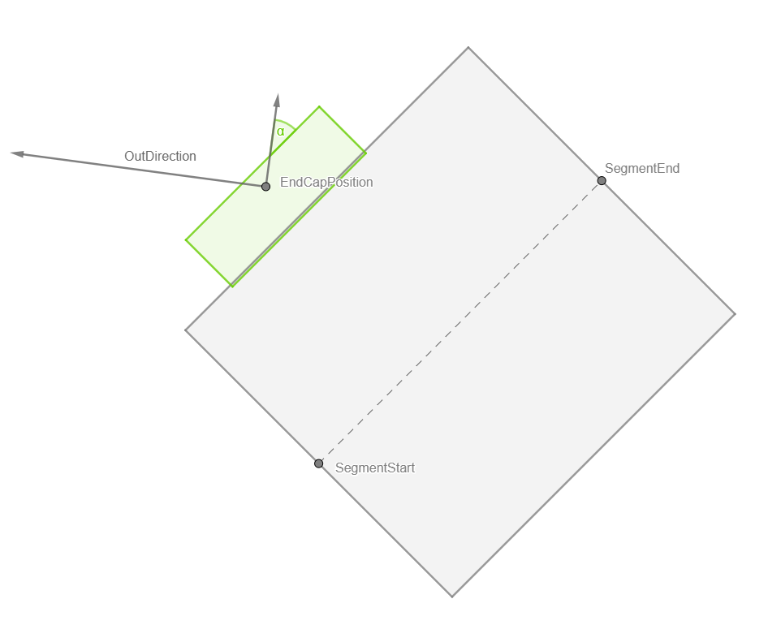
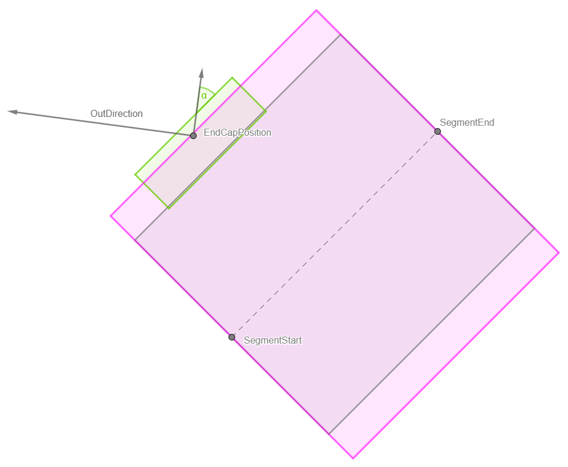
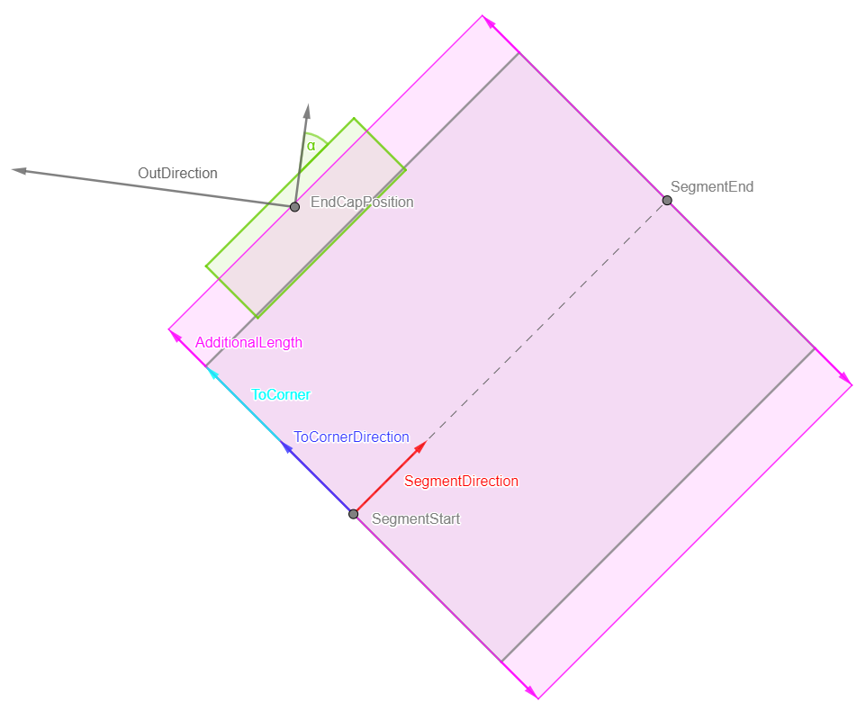
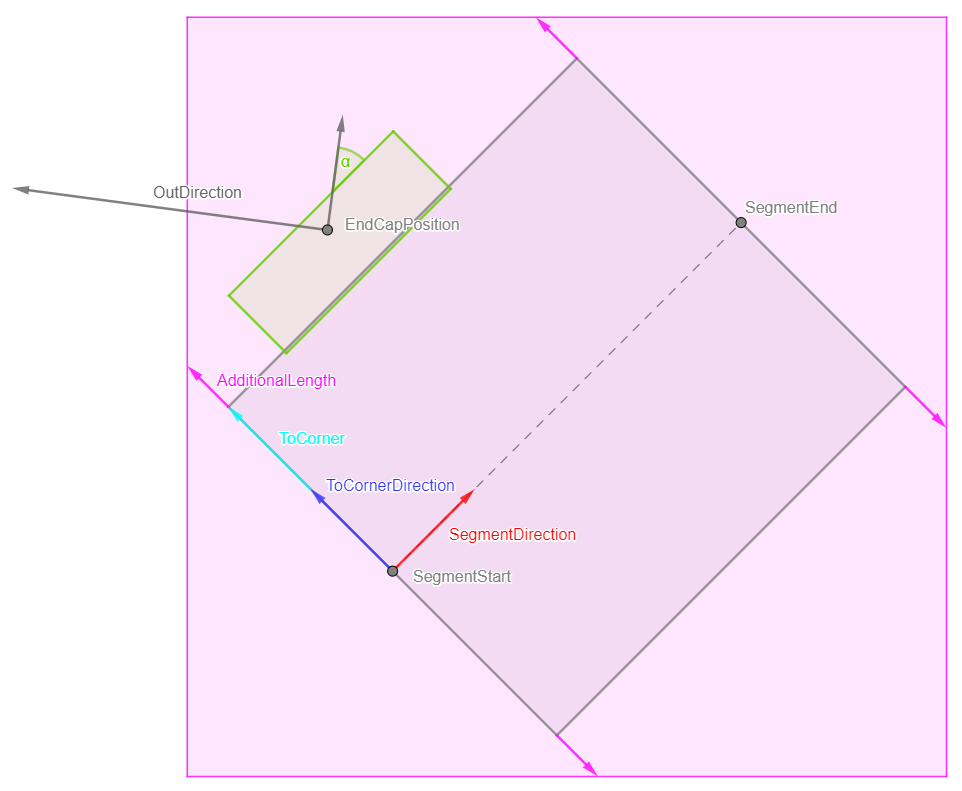
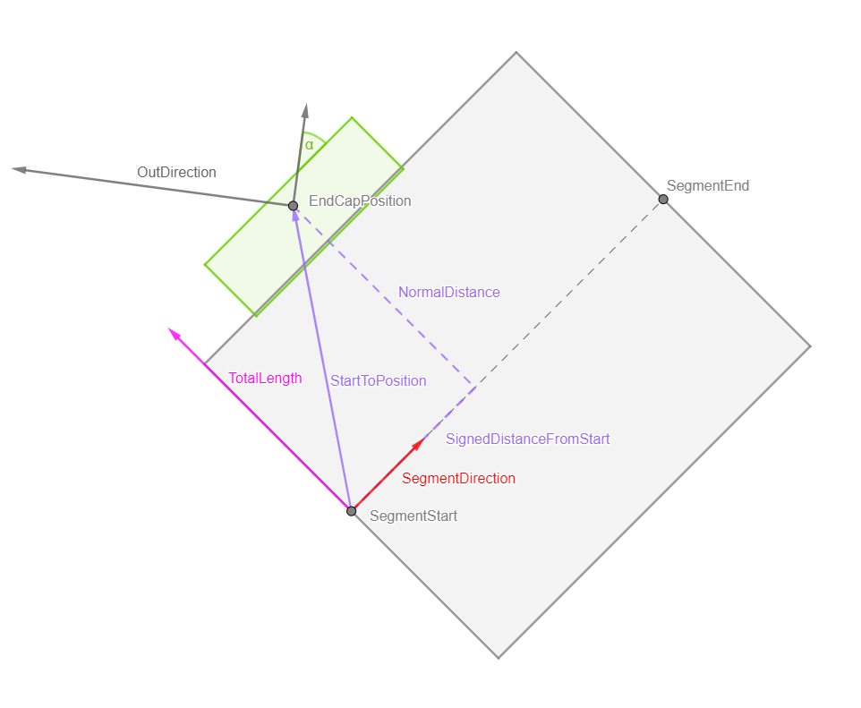
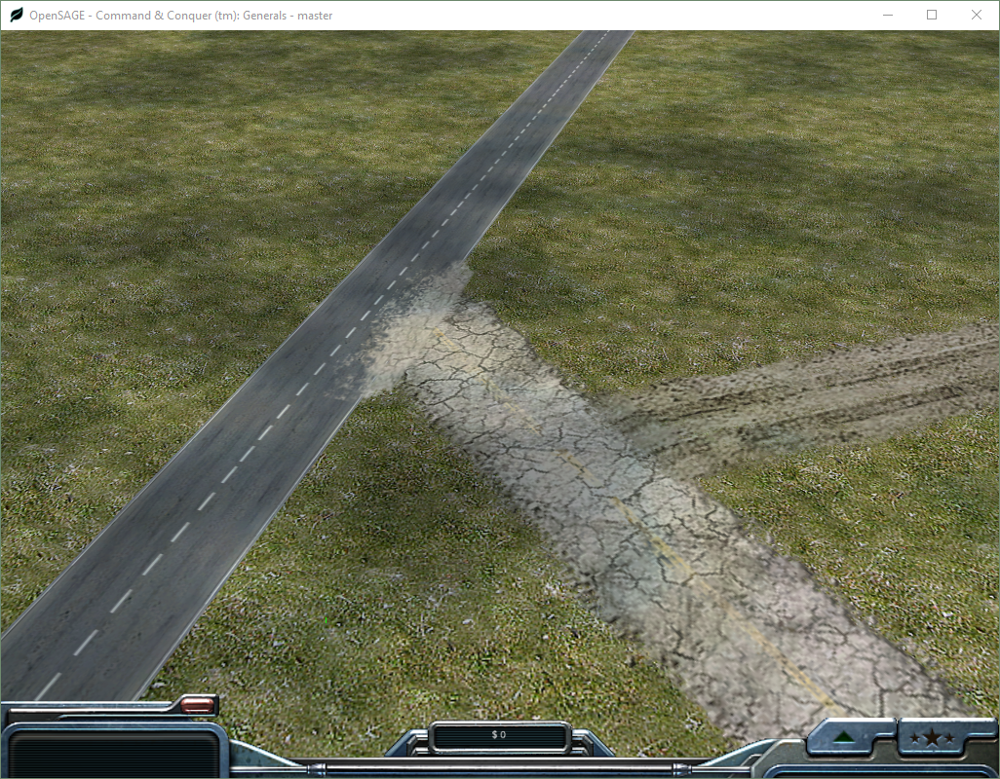

Figuring out how to render the roads correctly in OpenSAGE turned out to be a little more challenging than expected. This is the eleventh post in a series describing the journey.

In the [last post](/blog/roads-how-boring-part-10-considering-the-terrain) we took care of uneven terrain. All that's missing now are the end caps that can be added to straight road segments so that they "fade out" instead of ending abruptly.

At first glance, that doesn't look too difficult, we just need to figure out the world and texture coordinates. We know how to do that by now, and that alone would hardly warrant an extra post.

## Joining different roads
However, the checkbox says "Add end caps _and/or Join to different road_" and this is where things get interesting: When a road with an end cap ends near another road (of a different type), the end cap is rotated so that it forms a 90° angle with that other road. The straight road segment it belongs is modified accordingly (just like for [angled connections](/blog/roads-how-boring-part-5-connecting-the-road-segments)).

As you can see in the animation, this can lead to strange visual artefacts when the angle between the two roads becomes too small.

### Finding joinable roads

First, we need to find out if there is any road segment our end cap can join. We do that by looking at all straight road segments (joining curves or crosses does not work in the original engine).

Let's start with a road segment, an end cap position and a direction of the road the segment belongs to. When the position is near enough, the end cap rectangle (green) is rotated to match the road segment and we need to calculate the angle `α`.

We have to check if the position of the end cap node is within the road segment (plus a little margin). 

We know the segment direction. It's normal vector is the direction to the corner. The length to the corner is half a road width (`RoadWidth * RoadWidthInTexture / 2`). The additional length of the margin appears to be `RoadWidth / 10`.

Once we know the corner positions of that rectangle, a quick way to eliminate most of the join candidates is by checking if the end cap position is within the axis-aligned bounding box.

If it is, we need to check if is actually within the rectangle. We calculate the vector `StartToPosition` from the segment start position to the end cap position. The cross product of this vector and the `SegmentDirection` gives us the normal distance of the end cap position. Using the dot product, we can project `StartToPosition` onto `SegmentDirection` to get the `SignedDistanceFromStart`.

If the normal distance is less than `TotalLength` and `SignedDistanceFromStart` is between `0` and `SegmentLength`, then the end cap position is within the rectangle and we can calculate the angle `α` using trigonometric functions.

### Calculating the coordinates

The end cap quad's length is `0.375 * RoadWidth`, although it partially overlaps the road segment it belongs to (by `0.13 * RoadWidth`).
The default end cap width is `1.064 * RoadWidth`. Probably `RoadWidthInTexture` should also be considered here, but it isn't in the original engine.

However, as you can see in the animation above, when an end cap joins another road, it gets wider depending on the angle. We can calculate the actual width by dividing the default width by the cosine of the angle we calculated before.

The texture coordinates are just some more magic numbers:

|Left|Top|Right|Bottom|
|---|---|---|---|
|`0.146`|`0.697`|`0.238`|`0.961`|

And now we can render the end caps:

### Modifying the Z-order

One more thing we can see in the animation above is that the join affects the drawing order of the roads: By default, the light road is drawn below the dark one. But once the end cap becomes a join, it is drawn above (so that the end cap becomes visible).

Let `A`, `B` and `C` be different roads with this default order: `A, B, C`.

Whenever a join is encountered while reading a map file, the joining road is moved to the back of the list so that it is rendered last. There is only one global order, so _all_ roads of the joining road's type are now rendered above _all_ others (until the next join is encountered).

When we add a join from `A` to `C`, `A` is moved to the back (`B, C, A`) and we store the information, that `A > C`.

Let's add another join from `B` to `A`. The order becomes `C, A, B` and the dependencies are `A > C, B > A`.

Now let's add a join from `C` to `A`. `C` is moved to the back: `A, B, C`. However, we know that `A` has to come after `C`, so we move `A` with `C` and the order becomes `B, C, A`. But we also know that `B` has to come after `A`, so we have to move it to, and we end up with the order `C, A, B`.

Of course, there can be cycles (e.g. `A > C, C > A`). As there is only one global order, it is impossible to draw all end caps above the joined roads in such situations.

When it's written down like this, the algorithm doesn't look too complicated, but figuring out how it works just by examining different road joins proved to be quite difficult, as the outcome depends on the creation order of the roads. And while it may seem like an insignificant detail to get right, _not_ getting it right could have quite an impact on the visuals:

And...that's it, we're done! All that's left now is [summing-up](/blog/roads-how-boring-part-12-summing-up).