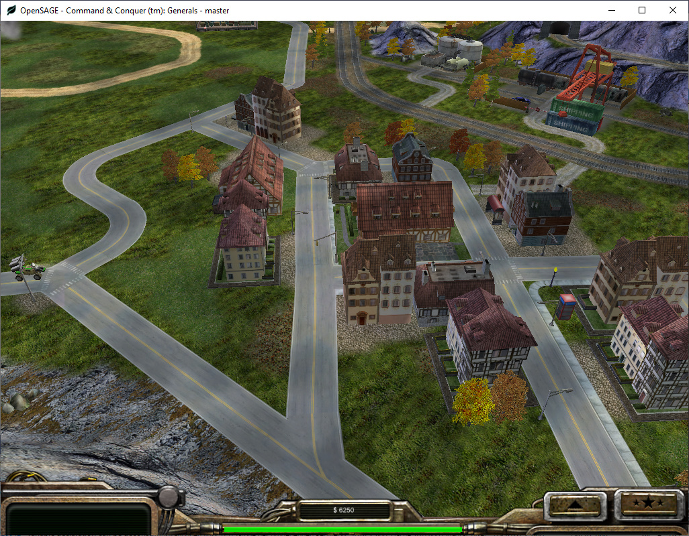
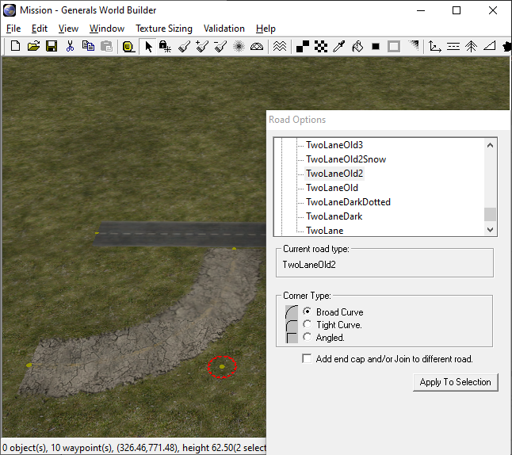
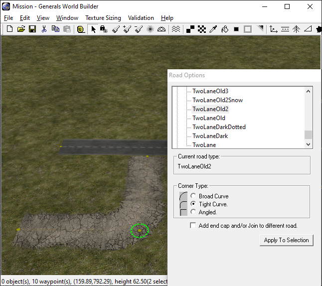
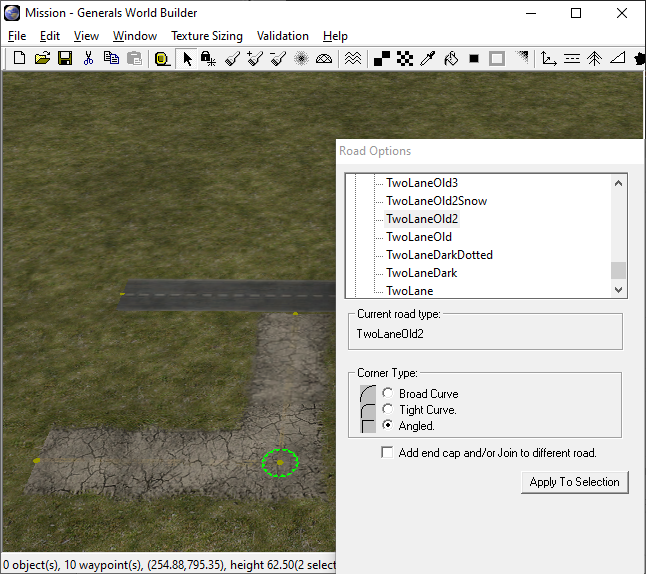
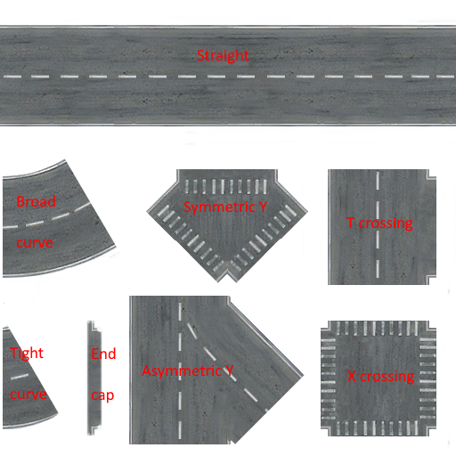
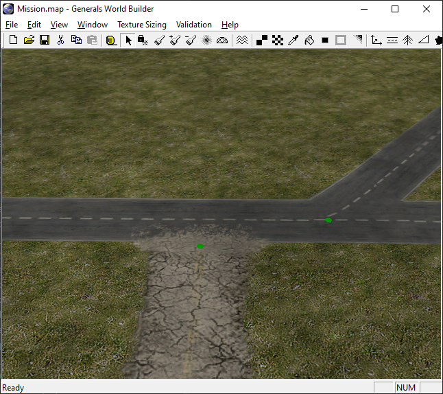

Figuring out how to render the roads correctly in OpenSAGE turned out to be a little more challenging than expected. This is the first post in a series describing the journey.



Here's a list of all posts published so far:

* [Part 1: Taking stock (this post)](/blog/roads-how-boring-part-1-taking-stock)
* [Part 2: Inspecting the map file](/blog/roads-how-boring-part-2-inspecting-the-map-file)
* [Part 3: Building a graph data structure](/blog/roads-how-boring-part-3-building-a-graph-data-structure)
* [Part 4: Rendering straight roads](/blog/roads-how-boring-part-4-rendering-straight-roads)
* [Part 5: Connecting the road segments](/blog/roads-how-boring-part-5-connecting-the-road-segments)
* [Part 6: Choosing a crossing type](/blog/roads-how-boring-part-6-choosing-a-crossing-type)
* [Part 7: Rendering crossings](/blog/roads-how-boring-part-7-rendering-crossings)
* [Part 8: Rendering crossings (continued)](/blog/roads-how-boring-part-8-rendering-crossings-continued)
* [Part 9: Rendering curves](/blog/roads-how-boring-part-9-rendering-curves)

We'll start by creating a test map in the World Builder for _Command & Conquer Generals Zero Hour_ to explore the different road types and their features.

## Creating a test map

We can create roads using the `Road` tool. First we have to select one of the predefined road types. There are quite a lot of different roads available in Zero Hour - we'll look into their definitions later on, but for now, let's just create a simple road network.


Individual road segments of the selected type can be created by dragging the mouse from a start to an end point.


When two endpoints are moved close enough together, World Builder automatically connects the two segments and merges the endpoints into a single one. This allows us to create a connected graph with _nodes_ and _edges_.


For each node, we can set the corner type that determines how corners are rendered, but it will only affect nodes with exactly two adjacent edges.

**Broad curve:**

**Tight curve:**

**Angled:**


If more than two edges are joined together, the node becomes a crossing and is rendered using a special texture:


A different texture is used depending on the number of edges and their angles. But where are they all defined?

It's time to look at the road definitions in the game's `Roads.ini` file. This is where all the road types we can select are listed. The definition of one type looks rather simple, it's just one reference to a texture and two widths:

```ini
Road TwoLaneDarkDotted
  Texture = TRTwoLane6.tga
  RoadWidth = 35.0
  RoadWidthInTexture = 0.9
End
```

Let's take a look at that texture:


Ah, so this is where the magic happens! Apparently there's one single image file for every road type containing the textures for all the different road types:

* Straight
* Broad curve
* Tight curve
* End cap
* Symmetric Y crossing
* Asymmetric Y crossing
* T crossing
* X crossing

There are three different versions of crossings for three edges and one for four. If more than four edges are connected to the same node, they are simply rendered as separate segments as there is no crossing texture.

Last but not least there is the checkbox labeled "Add end cap and/or Join to different road". It can be used to "blend" roads of different types together by rendering the small piece of texture between the tight curve and the Y crossing:



It should only be used for end points of a network (nodes with only one adjacent edge). When there is a different road near the end point, SAGE also tries to rotate the end cap so that it matches the other road. That works well for some cases, but when the angle becomes too small, it causes weird artefacts:


In [the next post](/blog/roads-how-boring-part-2-inspecting-the-map-file) we'll try to find out how this road network is stored in the map file.