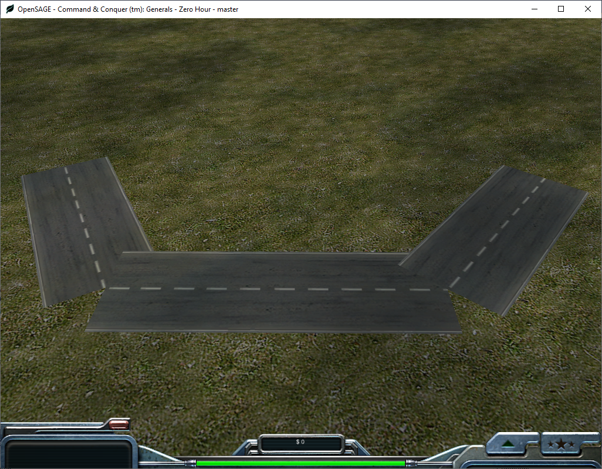
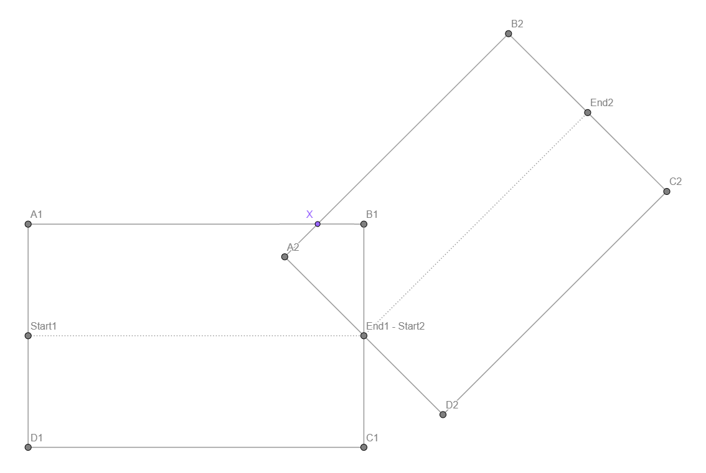
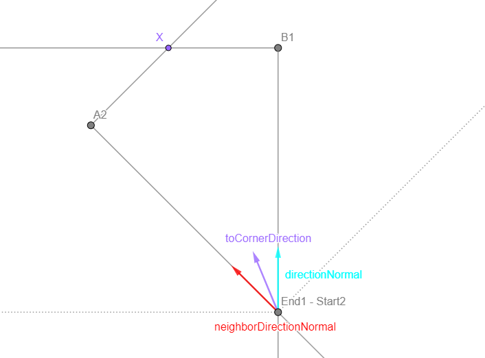
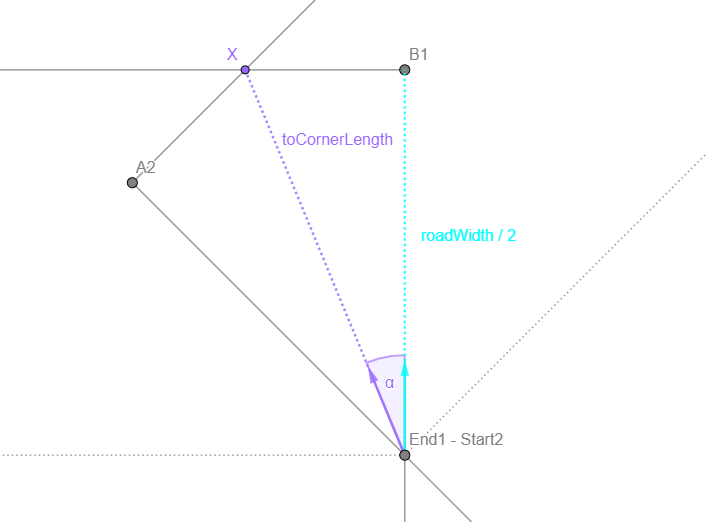
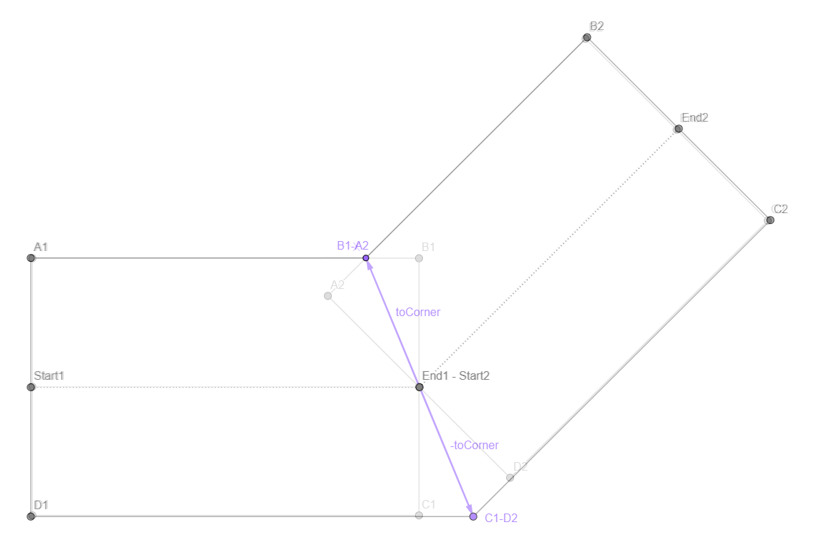
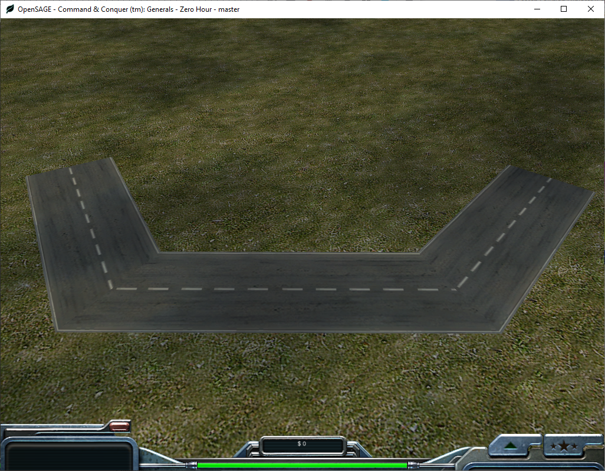

Figuring out how to render the roads correctly in OpenSAGE turned out to be a little more challenging than expected. This is the fifth post in a series describing the journey. In the [last post](/blog/roads-how-boring-part-4-rendering-straight-roads), we rendered road segments for the first time, but they are still disconnected and overlap each other:

Ignoring the different curve types for now, let's consider angled connections. We have two overlapping rectangles (one for each edge) that have an intersection point at the common node position (`End1 - Start2`). We want to modify the two corner points `B1` and `A2` so that they share the same position `X` (and then do the same for the other corner).

So, how can we calculate `X`? With the graph we created in [part 3](/blog/roads-how-boring-part-3-building-a-graph-data-structure), we can easily find the neighbor segment and its start and end position. For both the current and the neighbor segment, we can calculate the direction vector's normal (`directionNormal` and `neighborDirectionNormal`). We can calculate the average of these two vectors, normalize it and get a direction vector `toCornerDirection` pointing from the node position towards `X`.

Now we need to multiply this direction vector with the correct length to get to `X`. Considering the right-angled triangle `End1 - Start2`, `X`, `B1`, we know that 

`cos α = (roadWidth / 2) / toCornerLength` .

`cos α` can be calculated without actually knowing the angle by calculating the [dot product](https://en.wikipedia.org/wiki/Dot_product) of `directionNormal` and `toCornerDirection`. 

This gives us

`toCornerLength = (roadWidth / 2) / Vector3.Dot(directionNormal, toCornerDirection)`

and finally the vector to `X`:

`toCorner = toCornerDirection * toCornerLength`

Now we can calculate the new shared corner positions `B1 - A2` and `C1 - D2` by adding and subtracting the vector to the shared node position.

As we saw in the [last post](/blog/roads-how-boring-part-4-rendering-straight-roads), it's also important to adjust the U texture coordinate accordingly to avoid distortions.

Next time, we'll take a first look at crossings.