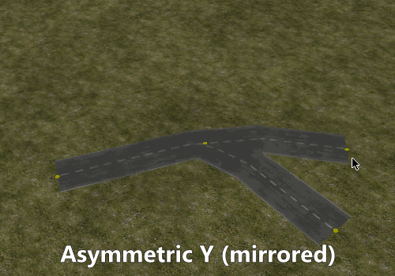
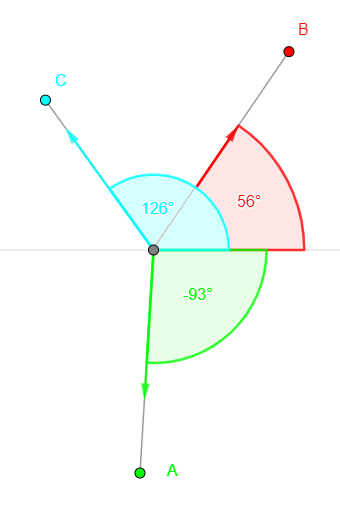

Figuring out how to render the roads correctly in OpenSAGE turned out to be a little more challenging than expected. This is the sixth post in a series describing the journey. [Last time](/blog/roads-how-boring-part-5-connecting-the-road-segments), we rendered road segments with angled connections. Before we examine the other connection types (tight and broad curves), let's take a look at the crossing textures:

We need crossings when three or four edges of our road graph meet at the same node. There is no texture for five or more edges, so in that case the segments are just rendered as straight roads without connections (so this case should be avoided when creating maps). There is only one crossing texture for four connected edges, but we have three variants of three-way crossings. We need to decide which one to use based on the angles between the three segments:

For each edge, we calculate the direction vector and the angle between this vector and the X-axis:

We then sort the edges by the angle to get a defined order for the edges around the crossing point. By a simple substraction we can determine the angles between adjacent edges (the angle between the first and last edge is a little more complicated because the sign changes).

Based on this information we can now choose the crossing type:

* If the largest angle between two edges is significantly smaller than 180°, we render a symmetric Y-crossing, because it is the only one where no two edges form a straight road
* Otherwise, if the two smaller angles are similar enough, we render a T-crossing
* Otherwise, we render an asymmetric Y-crossing

Now that we have decided which texture to render, the next step is to choose the orientation. We need to find a vector in world coordinates that corresponds to the Up vector in texture space. We can again use the angles we calculated before and similar logic as above. In case of the asymmetric Y crossing, it might also be necessary to mirror the texture.

In the next post, we'll render the crossings and connect them to their neighbors.