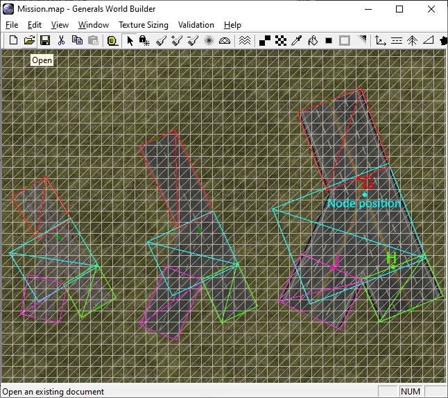
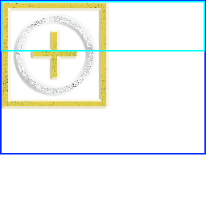
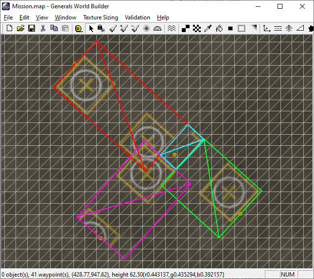
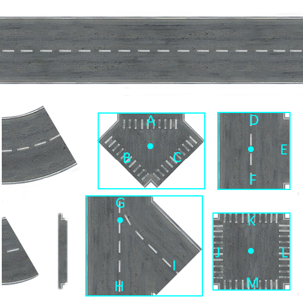

<style type="text/css">
img[src*="helipad_texture.png"] {
  border: 1px solid darkgray;
}
</style>

Figuring out how to render the roads correctly in OpenSAGE turned out to be a little more challenging than expected. This is the sixth post in a series describing the journey. After finding out when to render which crossing texture in the [previous post](/blog/roads-how-boring-part-6-choosing-a-crossing-type), we can now proceed to actually rendering them.

Consider the following screenshot of the same crossing with three different road types in wireframe mode:



In order to render a crossing, there are three things we need to figure out:

* The position and size of the rectangle in world coordinates where we want to render the texture
* The coordinates of that rectangle in texture space
* The end points of the adjacent road segments - it might not be obvious, but if you look closely at the rightmost road, you can see that the connected road segments sightly overlap the crossing texture (points G and H). It's best visible at point I that the adjacent road segment does not start at the edge of the crossing texture.

Let's start with the first problem.

## World coordinates

The size of the rectangle and its position relative to the crossing node position depends on the `RoadWidth` as well as the `RoadWidthInTexture`. Here are the definitions of the three road types shown above:

```ini
Road GravelRoad
  Texture = TRGravelRoad.tga
  RoadWidth = 33
  RoadWidthInTexture = .95
End

Road TwoLaneDarkDotted
  Texture = TRTwoLane6.tga
  RoadWidth = 35.0
  RoadWidthInTexture = 0.9
End

Road FourLaneDark
  Texture = TRFourLane2.tga
  RoadWidth = 60.0
  RoadWidthInTexture = 0.9
End
```

The larger `RoadWidth` and `RoadWidthInTexture` (remember, they are multiplied together), the larger the rectangle is going to be. By experimenting with different road types and measuring their sizes ([like we did](/blog/roads-how-boring-part-4-rendering-straight-roads) for straight roads), it should be possible to find formulas for calculating them. But wait...there are some road types with a `RoadWidthInTexture` of 3:

```ini
Road Helipad
  Texture = TRHelipad.tga
  RoadWidth = 15
  RoadWidthInTexture = 3
End
```

What's that supposed to mean? Several things are strange in the texture:



* There are no different textures for the various road types, just a single one.
* By default, the straight road texture takes up the top 25% of the whole image (light blue rectangle), but because the `RoadWidthInTexture` is so large, it now takes up a much bigger portion (dark blue rectangle).
* They look utterly broken when we try to create crossings:



Apparently these special textures are not supposed to form crossings or curves. None of these special road types are actual "roads" (another example would be the "Caution" texture we talked about in [part 3](/blog/roads-how-boring-part-3-building-a-graph-data-structure)).

To be honest, this seems more like a hack than anything else, but examining what happens when we do create a helipad crossing can give us some insights into the formulas we're trying to recreate:

* The rectangle for the crossing seems to be way too small, so it doesn't just linearly scale with `RoadWidthInTexture`.
* The crossing rectangle contains a small part of the helipad texture, which confirms that this texture just isn't meant to be used for crossings. It can still help us to find the formula for the texture coordinates later, though!

But first, without further ado, here are the rectangle sizes for all crossing types:

|Crossing type|Width|Height|
|---|---|---|
|T|`RoadWidthInTexture + Stub + Overlap`|`RoadWidthInTexture + 2 * Stub + 2 * Overlap`|
|X|`RoadWidthInTexture + 2 * Stub + 2 * Overlap`|`RoadWidthInTexture + 2 * Stub + 2 * Overlap`|
|Symmetric Y|`1.59`|`1.065 + Overlap`|
|Asymmetric Y|`1.2 + RoadWidthInTexture / 2`|`1.33 + Overlap`|

`Stub` is the length of the little "arms" extruding from the T and X crossings and can be calculated with the formula `0.5 * (1 - RoadWidthInTexture)`. This is also the reason why the crossings are broken when `RoadWidthInTexture` becomes larger than 1. 

All width and height values still need to be multiplied by `RoadWidth` to get the final result.

The formulas for T and X crossings make sense when you think about them, but the other two just contain magic numbers. Maybe they can be derived somehow...but we haven't found an explanation yet. Still, they appear to work, and that's good enough for now. :-)

### Rectangle offsets

When we know the size of the rectangle, we can calculate the offset of the node position from the top left corner:

|Crossing type|X|Y|
|---|---|---|
|T|`0.5 * RoadWidth`|`0.5 * Height`|
|X|`0.5 * Width`|`0.5 * Height`|
|Symmetric Y|`0.547 * RoadWidth`|`0.269 * Height`|
|Asymmetric Y|`0.5 * RoadWidth * RoadWidthInTexture`|`0.2 * Height`|



Next time, we'll solve the other two problems (figuring out the texture coordinates calculating the start positions of the adjacent road segments A-G).