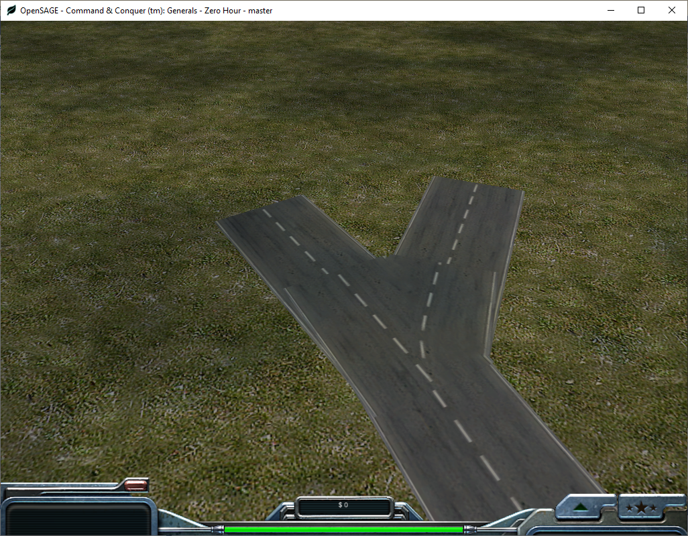
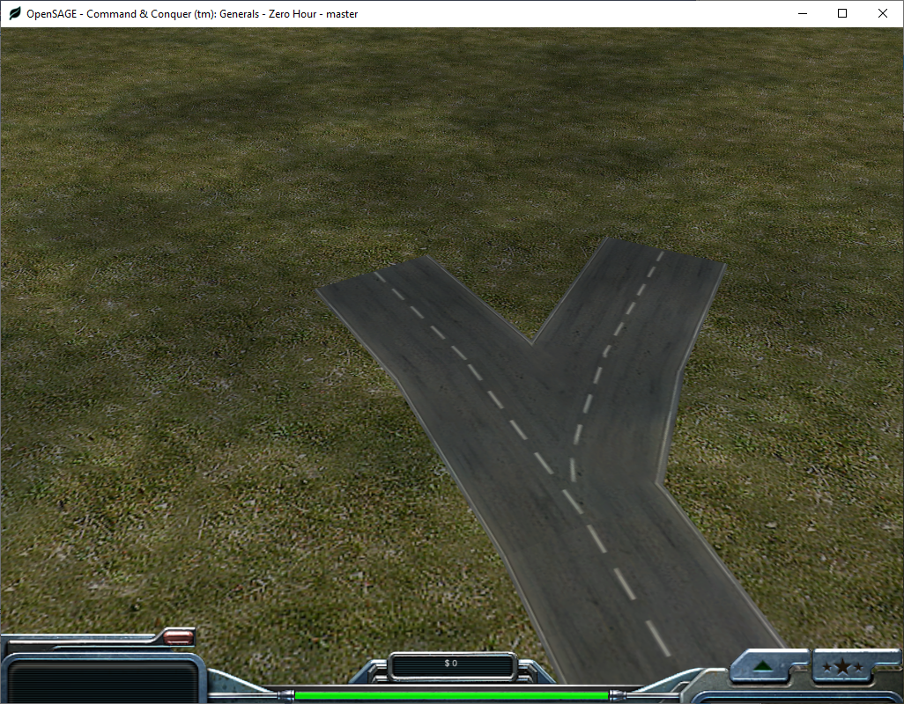

Figuring out how to render the roads correctly in OpenSAGE turned out to be a little more challenging than expected. This is the eighth post in a series describing the journey. [Last time](/blog/roads-how-boring-part-7-rendering-crossings), we started rendering crossings and found the formulas for calculating the rectangles in world coordinates based on the parameters `RoadWidth` and `RoadWidthInTexture`.

## Texture coordinates

Now we need to find the coordinates of these rectangles in the road texture, just as we did for the straight roads in [part 4](/blog/roads-how-boring-part-4-rendering-straight-roads).

Let's start by dividing the whole texture into a 3x3 grid. The center of the T crossing is located at the center of tile [2, 3], and the center of the X crossing is located at the center of tile [3, 3]. In texture space, they are located at [3/6, 5/6] and [5/6, 5/6] respectively. However, as we found out in [part 4](/blog/roads-how-boring-part-4-rendering-straight-roads), the engine approximates 1/6 as `1.666`, truncating all decimal places after the third. This also happens for the center of tile two, which is not `0.5`, but `0.498 (3 * 1.666)`.

We also already know that the default road width of `0.25` is scaled with the factor `RoadWidthInTexture`. Now we only need the lengths of the small extruding stubs. By measuring some textures of different sizes, we can find out that it is `0.004` regardless of `RoadWidthInTexture`.

Using the variables

|Name|Abbreviation|Value|
|---|---|---|
|Half tile width|`htw`|`0.166`|
|Half road width|`hrw`|`0.25 * RoadWidthInTexture / 2`|
|Length to incoming road|`lti`|`0.25 / 2 + 0.004`|

this gives us the following texture coordinates for the T- and X-crossing:

|Crossing type|Left|Top|Right|Bottom|
|---|---|---|---|---|
|T|`5 * htw - hrw`|`3 * htw - lti`|`5 * htw + lti`|`3 * htw + lti`|
|X|`5 * htw - lti`|`5 * htw - lti`|`5 * htw + lti`|`5 * htw - lti`|

Unfortunately the two Y crossings are a little less straight forward and require some hardcoded numbers (this time, width and height are given instead of right and bottom coordinates):

|Crossing type|Left|Top|Width|Height|
|---|---|---|---|---|
|Symmetric Y|`3 * htw - 0.2`|`0.504 - 0.135`|`0.4`|`0.270`|
|Asymmetric Y|`0.395 - hrw`|`0.645`|`1.2 * 0.25 + hrw`|`0.335`|

Using these coordinates, we can now render the crossings, but it doesn't look quite right yet:

The crossing texture and the straight road segment textures overlap because the segments all start directly at the node position.

## Connection points

We need to move the end points of the incoming road segments outwards to the positions labeled A-M in the image above.

The following table lists the vectors that need to be added to the node positions to get to these connection points (`Up`, `Down`, `Left`, `Right`, `DownLeft` and `DownRight` being unit vectors pointing in the respective directions and `Width` and `Height` referring to the rectangles we calculated in the [last post](/blog/roads-how-boring-part-7-rendering-crossings)).

|Crossing type|Position|Vector from|
|---|---|---|
|Symmetric Y|A|`Up * (0.269 * Height)`|
|Symmetric Y|B|`DownRight * (0.547 * RoadWidth)`|
|Symmetric Y|C|`DownLeft * (0.547 * RoadWidth)`|
|T|D|`Up * (Height / 2)`|
|T|E|`Right * (Width - HalfRoadWidth)`|
|T|F|`Down * (Height / 2)`|
|Asymmetric Y|G|`Up * 0.2 * Height`|
|Asymmetric Y|H|`Down * 0.8 * Height`|
|Asymmetric Y|I|`DownRight * (1.047f * RoadWidth)`|
|X|J|`Left * (Width / 2)`|
|X|K|`Up * (Height / 2)`|
|X|L|`Right * (Width / 2)`|
|X|M|`Down * (Height / 2)`|

And now, finally, the crossings are done:

In the next post we'll tackle the curves.