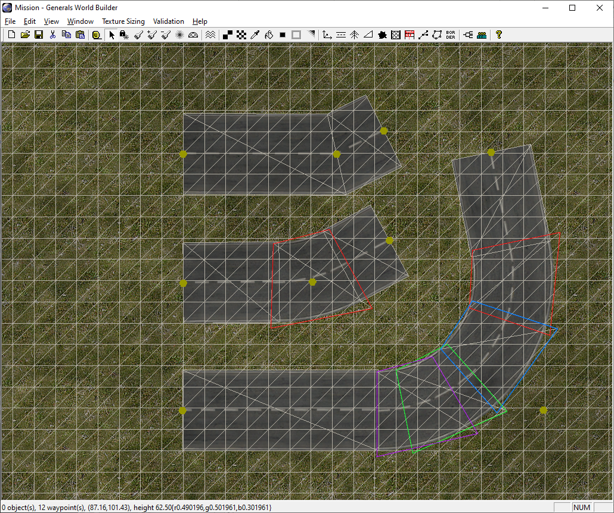
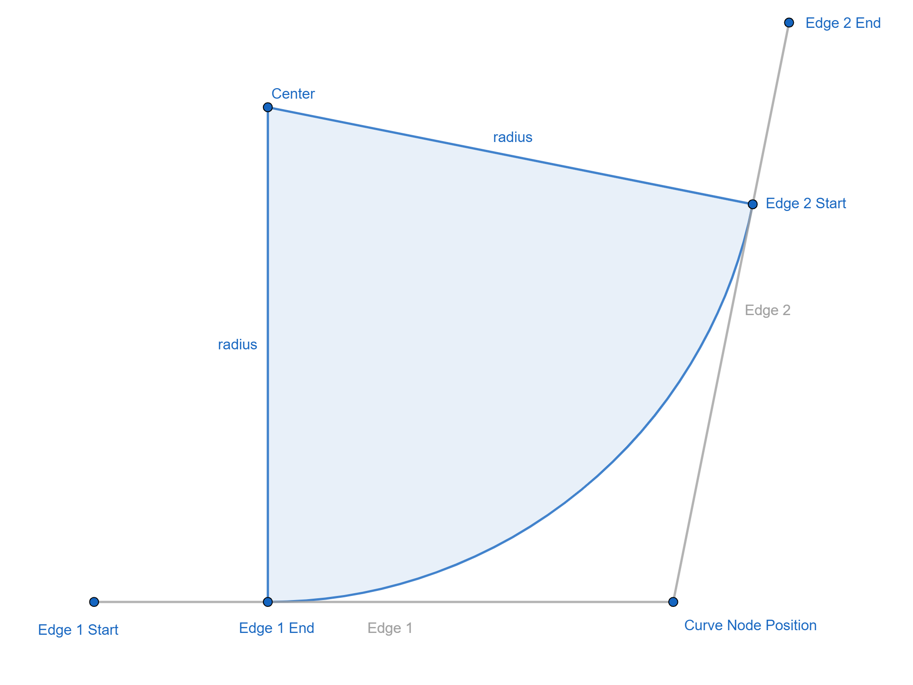
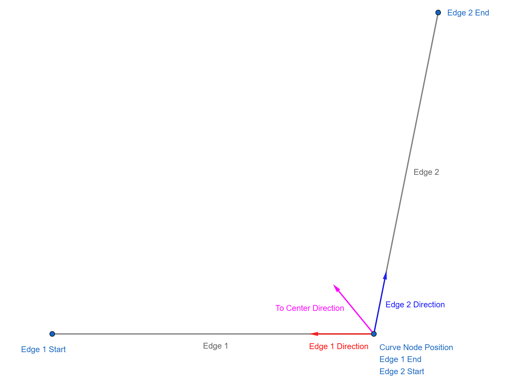
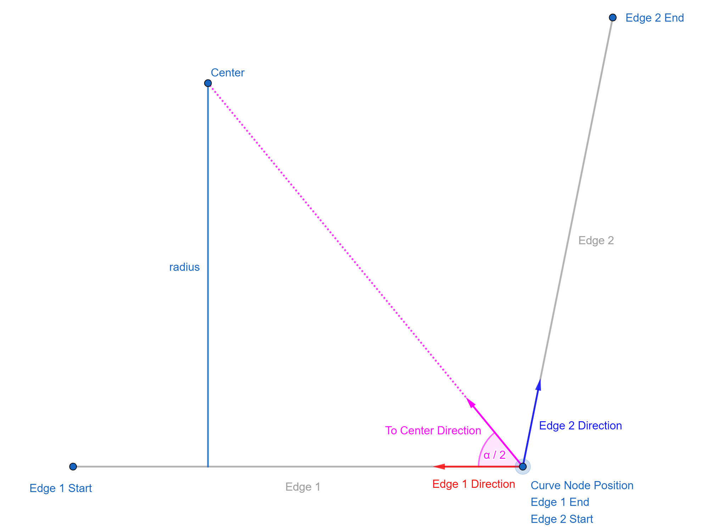
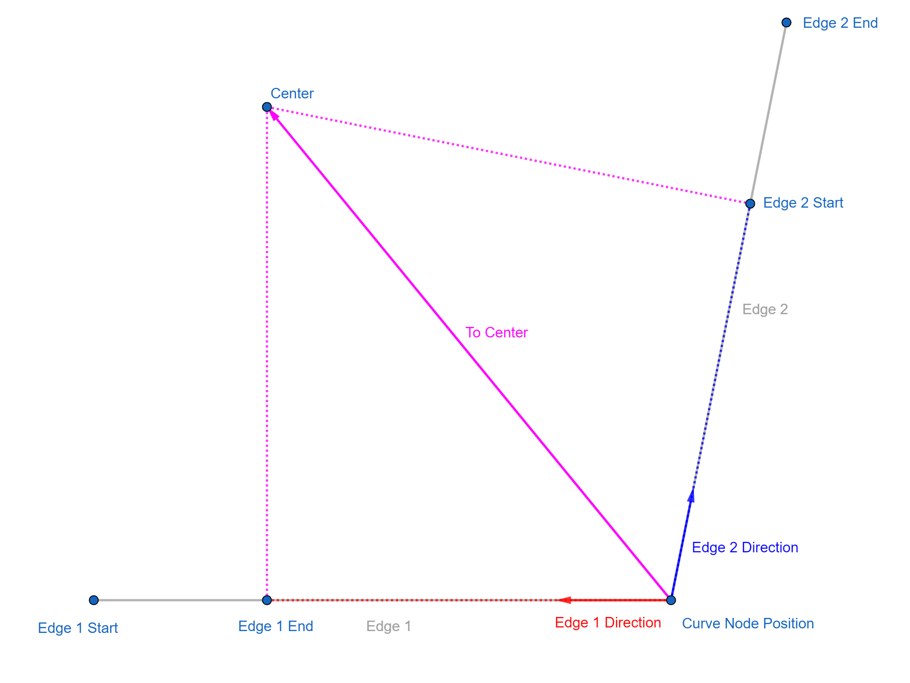
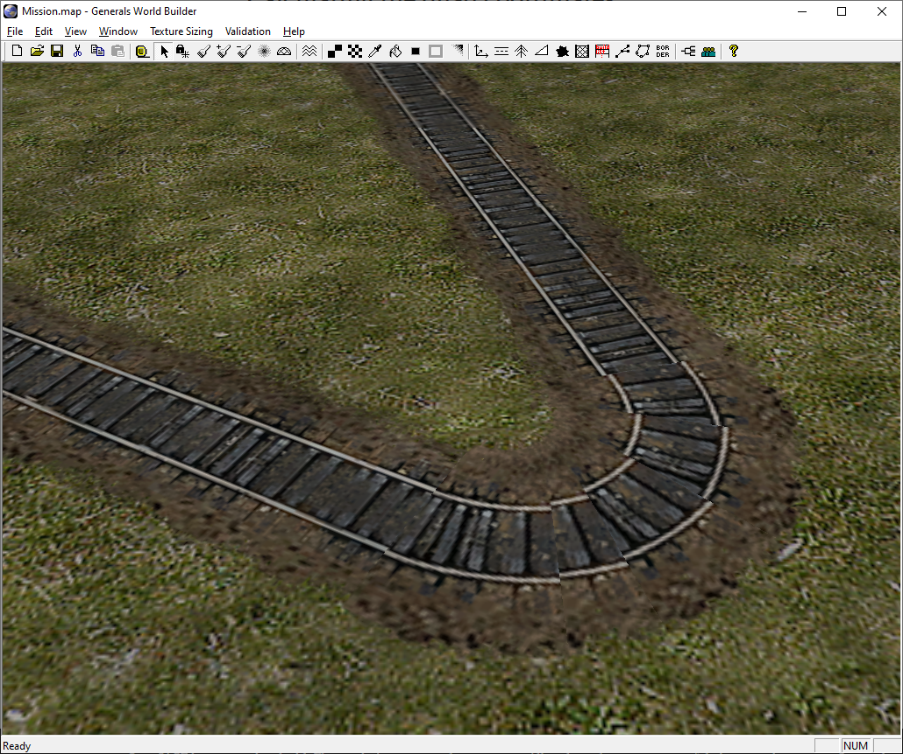
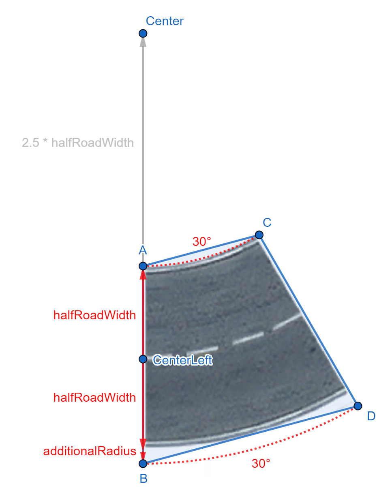
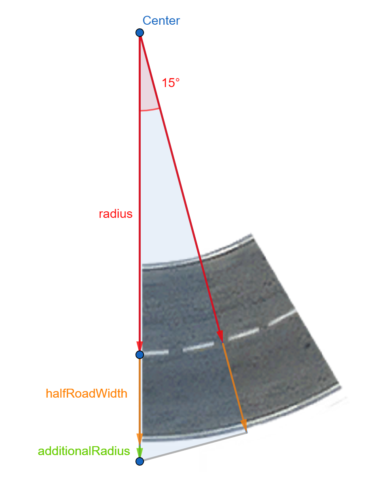
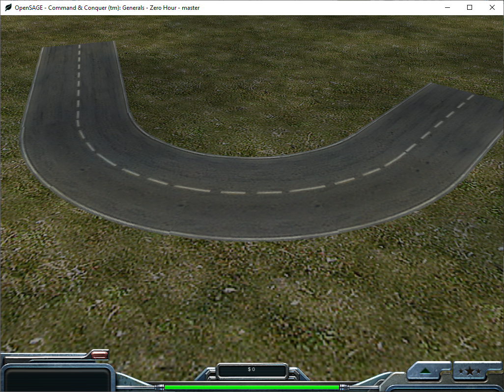
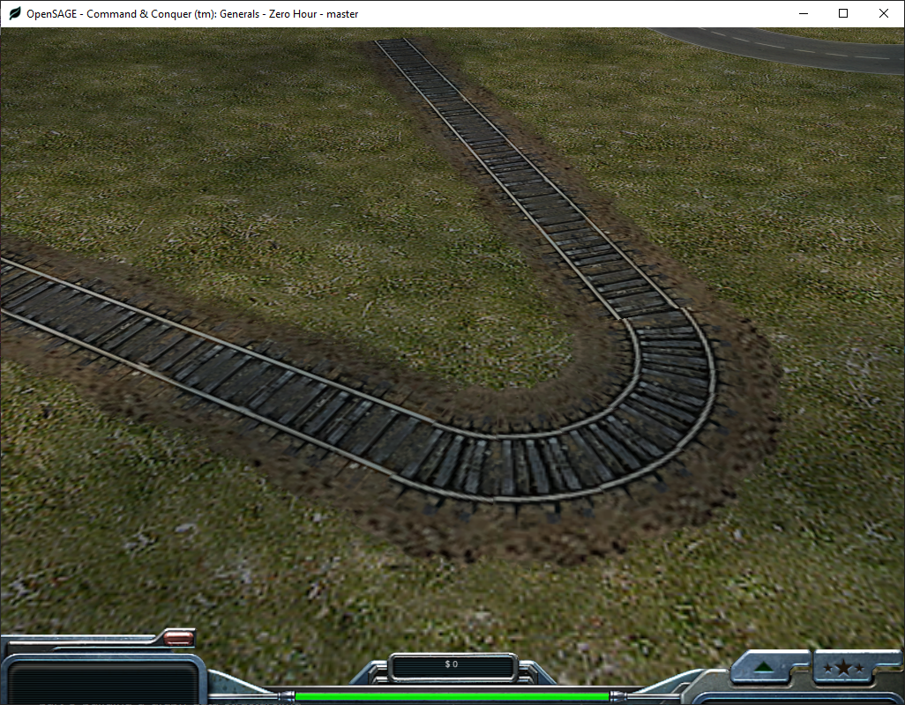

Figuring out how to render the roads correctly in OpenSAGE turned out to be a little more challenging than expected. This is the ninth post in a series describing the journey.

As we discovered in [part 1](/blog/roads-how-boring-part-1-taking-stock), there are three ways of connecting road segments:

* Angled
* Broad curve
* Tight curve

We can already draw angled connections since [part 5](/blog/roads-how-boring-part-5-connecting-the-road-segments), so now let's examine some broad curves:



* Curves are rendered as a series of quads. The number of quads depends on the angle between the two road segments:
    * Below 27°, an angled connection is rendered (see top road in the screenshot)
    * Then, the number of quads increases in 30° steps, so from 30° to 60° two quads are used, from 60° to 90° three quads, and so on.
* The quads overlap their neighbors a little bit.
* The last quad (the purple one in the screenshot) can overlap the previous one more when the total angle isn't a multiple of 30°.
* The end points of the adjacent road segments are "pushed back" so that there is enough space to render the quads (the straight segments stop where the quads start).
    * When we increase the angle so much that the end point would be pushed beyond the start point, an angled connection is rendered instead (not shown in the screenshot).

## Calculating the endpoints

Let's start by calculating these new endpoints - the points between which we'll render the curve.

The curve can also be seen a as a segment of a circle. The radius is a fixed multiple (`3.5` for broad curves, `1.28` for tight curves) of `HalfRoadWidth` (which can be calculated by `RoadWidth` * `RoadWidthInTexture` / `2`).



In order to find the center of the circle, we can calulate the average of the direction vectors of the two edges and normalize it. This gives us a direction vector pointing to the center.



The length can be easily calculated as `radius / cos(α / 2)` with `α` being the curve angle.



Once we know the vector to the center, we can project it onto the original edge direction vectors using the dot product to get the end points:



```
Edge 1 End =
    Curve Node Position + Edge 1 Direction * Dot (To Center, Edge 1 Direction)

Edge 2 Start =
    Curve Node Position + Edge 2 Direction * Dot (To Center, Edge 2 Direction)
```

## Calculating the quad coordinates

Now we need to generate the overlapping quads. Just as for the other road types, we need the world coordinates as well as the texture coordinates for the points defining the quads.

The original engine's quads are neither symmetric nor in any way intuitive to figure out. Besides, they don't seem to work that well anyway:



So let's not waste time trying to replicate them. Instead, we can try to come up with our own quads. Consider the following image:



Starting from `CenterLeft`, we can calculate `A` by going up `halfRoadWidth` units and `Center` by going up `3.5 * halfRoadWidth` units.

`B` needs to be further down than just `halfRoadWidth`. The part labeled `additionalRadius` can be calculated using a 15° triangle as follows:



`cos(15°) = (radius + hrw) / (radius + hrw + additionalRadius)`

`additionalRadius = (radius + hrw) * (1 - cos(15°)) / (cos(15°)`

We can use these formulas for both the world coordinates and the texture coordinates.

## Summing up

Now all that's left to do is generating the right number of quads based on the curve angle. Some textures don't fill the entire quad, which is why we need the quads to overlap slightly.

Tight curves work just the same, the only difference is the smaller radius (`1.28` instead of `3.5`).





We can now render all road types except the end caps!

There's one elephant in the room, though, that we ignored so far: We don't consider the terrain height yet.

But that's another story for another post...