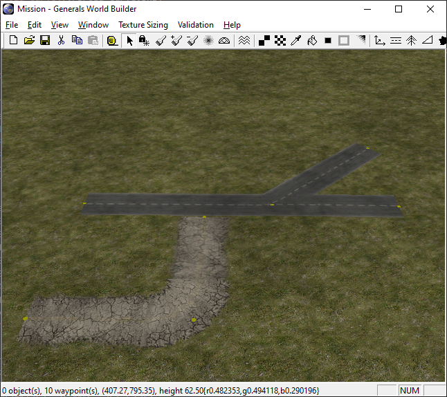

Figuring out how to render the roads correctly in OpenSAGE turned out to be a little more challenging than expected. This is the second post in a series describing the journey. In [part 1](/blog/the-way-is-the-goal-part-1-taking-stock) we created a test map with some roads and looked at the textures for the different road types.



## Inspecting the map file

Now that we finished our road network, let's save the map and see how all this information is stored in the map file...or rather, how it's _not_ stored. While we can observe the described behavior (close endpoints are merged to form crossings) in World Builder, the map file pretty much doesn't care about graphs, nodes or edges. There's simply a pair of map objects for each road segment.

For our map above, it looks like this:

|Type|X|Y|RoadType|
|---|---|---|---|
|TwoLaneDarkDotted|191|412|Start|
|TwoLaneDarkDotted|346|410|End|
|||||
|TwoLaneDarkDotted|450|407|Start|
|TwoLaneDarkDotted|346|410|End|
|||||
|TwoLaneDarkDotted|471|540|Start|
|TwoLaneDarkDotted|346|410|End|
|||||
|TwoLaneOld2|288|288|Start \| TightCurve|
|TwoLaneOld2|182|289|End|
|||||
|TwoLaneOld2|288|288|Start \| TightCurve|
|TwoLaneOld2|291|393|End|

The `RoadType` is a bit field that contains information about whether this is a start or end point and about the curve type (the default is `BroadCurve`, whereas `TightCurve` and `Angled` have their own bits).

So...each road segment is represented by a pair of objects with their `RoadType` set to `Start` and `End`.

## Building the graph

In order to decide which textures we have to draw, we need to build a graph data structure with _nodes_ and _edges_. That way we can use the number of edges and the angles between them for each node to select a texture for the crossing or curve. The following classes are used for building the data structure:

```csharp
internal sealed class RoadTopologyNode
{
    public Vector3 Position { get; }
    public List<RoadTopologyEdge> Edges { get; } = new List<RoadTopologyEdge>();

    // ...
}

internal sealed class RoadTopologyEdge
{
    public RoadTemplate Template { get; }

    public RoadTopologyNode Start { get; private set; }
    public RoadType StartType { get; private set; }

    public RoadTopologyNode End { get; private set; }
    public RoadType EndType { get; private set; }

    // ...
}
```

We do that by creating a _RoadTopologyEdge_ for every pair of points. For both endpoints, we either create a new _RoadTopologyNode_, or we reuse an existing one if we already created one at *exactly* the same location and with the same type (roads of different type are never connected):

```csharp
        public void AddSegment(RoadTemplate template, MapObject start, MapObject end)
        {
            var startNode = GetOrCreateNode(start.Position);
            var endNode = GetOrCreateNode(end.Position);

            // Edge case handling omitted for brevity (pun maybe intended)

            var edge = new RoadTopologyEdge(
                template,
                startNode,
                start.RoadType,
                endNode,
                end.RoadType,
                Edges.Count);

            Edges.Add(edge);

            startNode.Edges.Add(edge);
            endNode.Edges.Add(edge);
        }
```

But wait, there's more. 

TODO: Describe road alignment