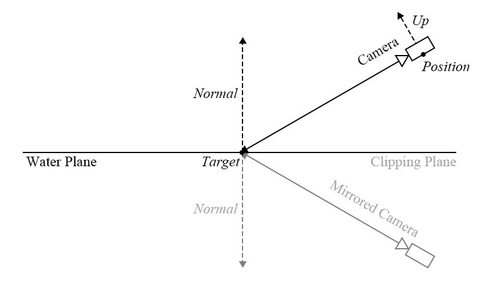
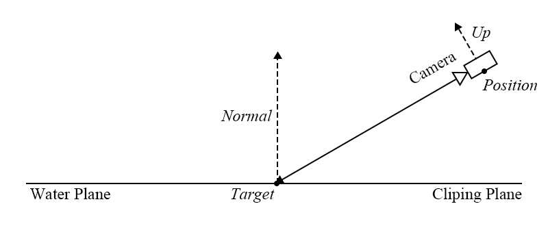
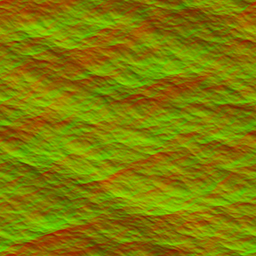
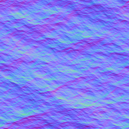
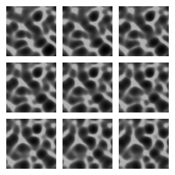
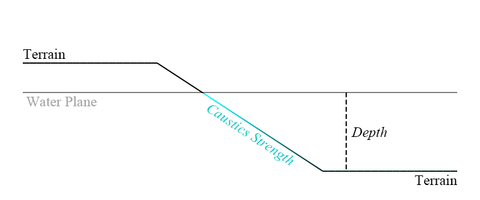
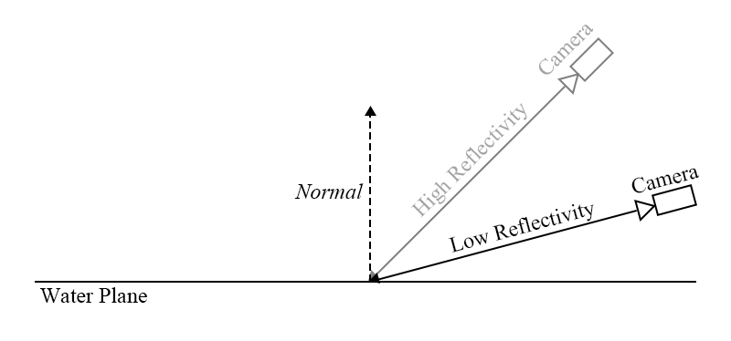
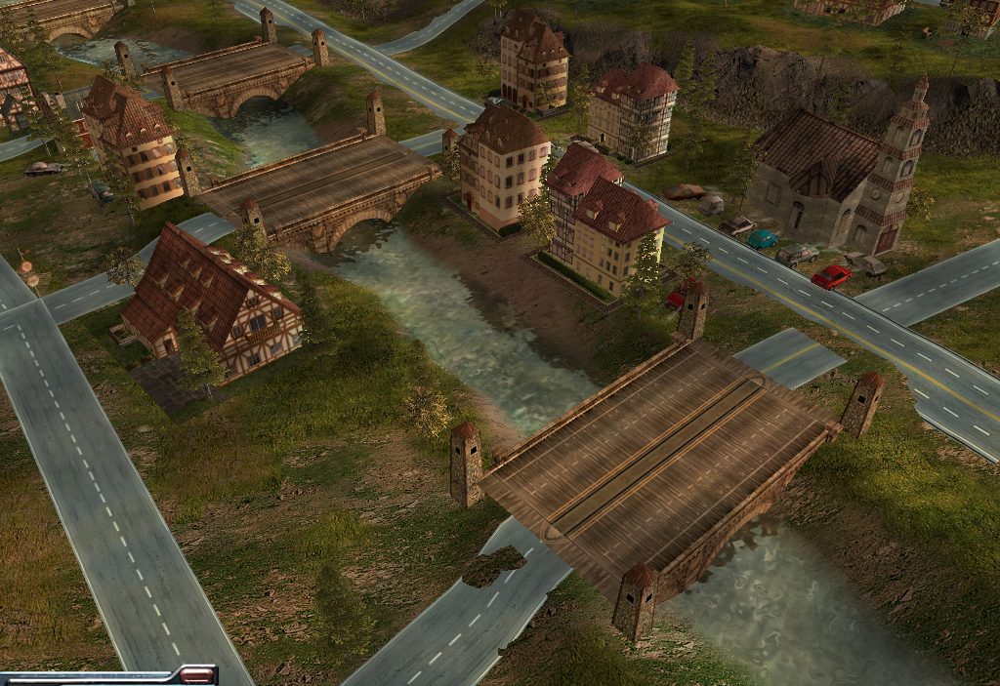

## Overview
Water can be broken down into several main components: reflection, refraction, waves and caustics.

**Reflection** may include the reflection of the enviroments, game objects, light sources and self-reflection. It should reflect what's on the surface while blending the colour and the waves of the water itself.

**Refraction** is kind of the opposite of reflection. Instead of reflecting what's on the surface, it should distort what's under the surface with respect to the colour, the waves and the depth of the water.

**Waves** are distortion on the surface level caused by forces of nature such as wind. Waves in a river, a lake and an ocean aren't the same, we should take that fact into consideration.

**Caustics** are, basically speaking, dancing lights you see both under and above a body of moving water. It's actually caused by reflection and refraction, but for simplicity's sake, we'll just talk only about the refraction aspect.

## Reflection
There are many ways to implement reflection namely cube map, environment map, planar, screen space or the new real-time "ray tracing." In the case of the original game and this implementation, we'll be using the planar method.
In a nutshell, planar reflection is:
1. You mirror a copy of the player's camera in respect to the water plane in symmetrical manner.
2. You go down the render pipeline almost the same as you would the actual camera but you render to a new frame buffer using the mirrored camera and inverted clipping plane.
3. Use the frame buffer as a texture on the plane and apply shader techniques to it to make it looks convincing.

This is done per plane so the more water plane present on the map, the more expensive it is.

*
Figure 1: Camera For Reflection Rendering
*

## Refraction
Refraction is fairly simple to achieve. You only need to render it the parts that's below the water plane.
So in a nutshell:
1. Using the current player camera and clipping plane, render to a new frame buffer.
2. Use the frame buffer as a texture on the plane and apply shader techniques to it to make it looks convincing.

*
Figure 2: Camera For Refraction Rendering
*

## Waves
This is done at shader level either via vertex or fragment. Many techniques could be used here including DuDv mapping, bump mapping, nomral mapping, etc.
We'll using only fragment for this implementation.

**DuDv Mapping** is simply a directoinal distortion map usually derived from a normal map. It only has R and G channels for offsetting U and V vaules of the texture. This creates ripple effect on the surface.

*
Figure 3: Sample DvDu Map
*

**Normal Mapping** is an extensive bump map uses for lighting calculation. Having all RGB channels, they are represented as XYZ directions. This creates the illusion of detailed surface without having a lot of polygons.

*
Figure 4: Sample Normal Map
*

## Caustics
This is also done at shader level as well using fragment. The simplest and the only way I know how to do is using animated textures. By having a set of pre-baked textures, one can animate it to simulate the effects of caustics.
At higher level of shadering, I assume one may simulate casutics from the movement of the waves and direction of the lightsource.

In a nutshell, you use add blending to apply the animated textures to terrain and objects under the water plane with respect to the depth of said subjects. The deeper the subject, the more transparent the apply should be.

*
Figure 5: Samples of Caustics Map
*

*
Figure 6: Caustics Rendering
*

## Miscellaneous
**Fresnel Effect** A principle of reflectivity. Shallow angle = strong reflectivity, steep nagle weak reflectivity. By applying this principle to reflection and refraction rendering, one can improve the realism of water rendering.

*
Figure 6: Fresnel Rendering
*

## Result
Combining those components together, you get the result down below: an improved version of vanilla water from early reveal screenshots. While not the fanciest water you might have ever seen but still, it looks more watery than AoE4's attempt.

With time and afford, you can make it even more convincing but that is a discussion for another time.