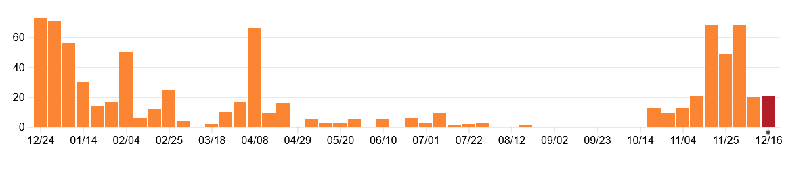
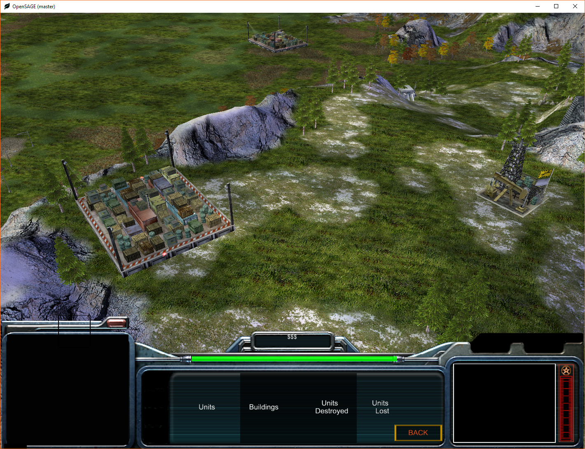
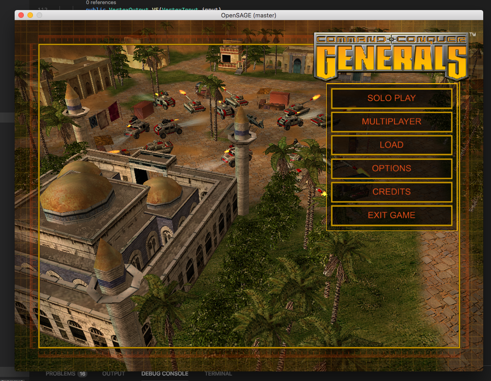
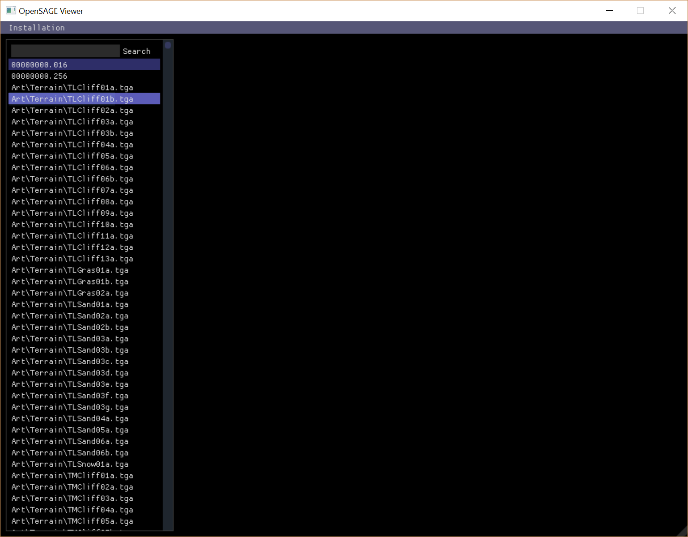
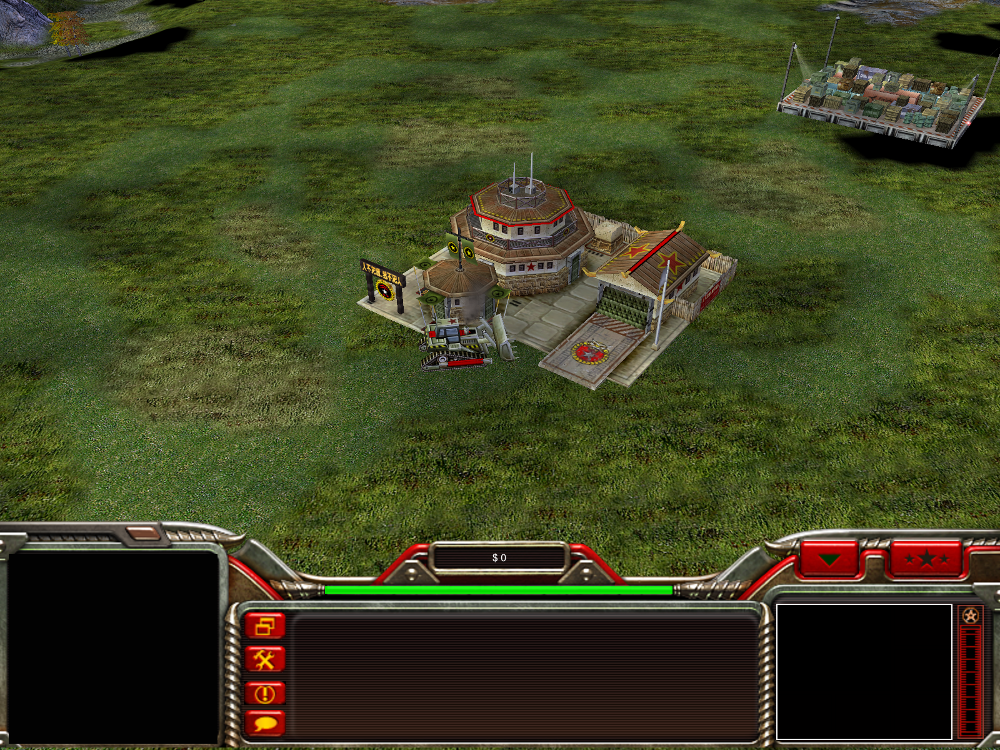
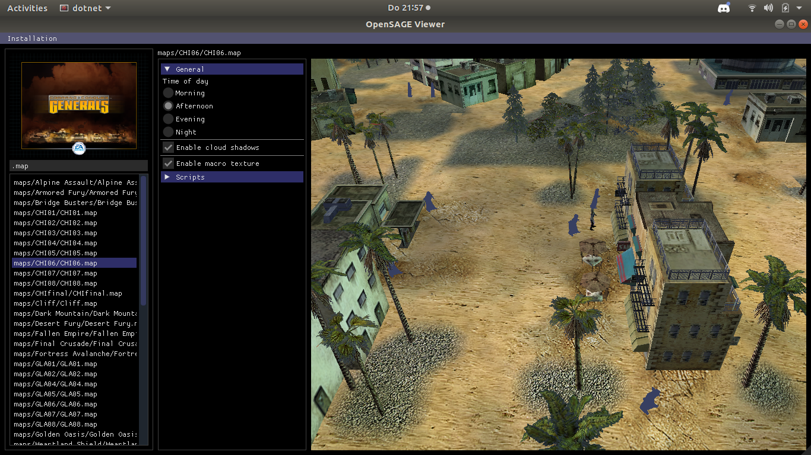
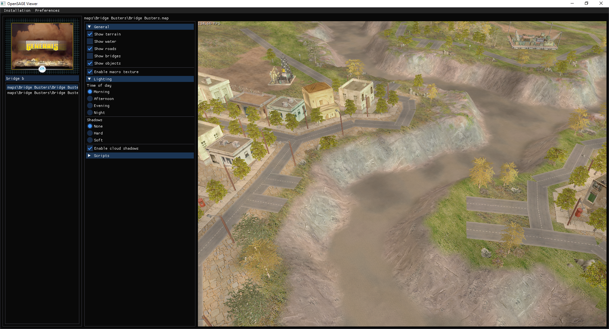

_OpenSAGE is an open source C# re-implementation of the SAGE game engine, which was used for multiple Electronic Arts RTS games in mid-to-late 2000s. Our current focus is on Command & Conquer™: Generals. For more information visit our [About](/) page._

It has been a great year for OpenSAGE. It saw our first release, the implementation of many important features, the beginning and continuing growth of our community and the shift from a single developer's hobby project towards a proper open source team effort.

So far in 2018 OpenSAGE has received about **850 commits** from **10 contributors**, not counting unmerged PRs at the time of writing.
Our [Discord](https://discord.gg/G2FhZUT) server (which was created in early January) has almost **200 users**. We got featured on [GamingOnLinux](https://www.gamingonlinux.com/articles/opensage-an-early-wip-game-engine-for-command-conquer-generals-adds-linux-support.12025), mentioned on various social media sites, and even got discussed about in Chinese and Russian C&C communities.

Here's the commit graph for the main repository from December 2017 to December 2018, grouped by week.

The first few months of the year were some of the most productive in the project's history, and active development continued throughout spring.
After a slow summer and a quiet autumn the development pace has picked up again, and we've reached last year's activity peak again.

## What have we done this year

We are not going to go through every change that happened during the year, as there's way too much to cover, but I tried to pick the most important ones.
I recommend preparing by making a cup of a seasonally appropriate beverage of your choosing before continuing. It's going to be a long one.

### January

Tim started the work towards making the engine truly cross-platform. The unfinished macOS-specific Metal renderer was removed, and Windows-specific libraries and technologies were started to be replaced with cross-platform equivalents. First few shaders were ported from HLSL to C# using [ShaderGen](https://github.com/mellinoe/ShaderGen), and we adopted [SDL2](https://www.libsdl.org/) for window creation and input handling. Tim also continued his work on parsing game archives and assets, started redesigning our scene graph and made various fixes and optimizations.

Stephan focused his attention on APT, the Flash-based UI system used in later SAGE titles. This involved building parsers for various file formats, implementing UI views for the data viewer, and even implementing a virtual machine for ActionScript bytecode.

Perhaps the most important change I made in January was the game launcher executable. While a simple feature consisting of a few dozen lines of code, it brought together many features that had been built during the previous months. I also rewrote our scripting system (based on days of testing of various edge cases), implemented [Catmull-Rom spline](https://en.wikipedia.org/wiki/Cubic_Hermite_spline#Catmull%E2%80%93Rom_spline) interpolation to make scripted cameras super smooth, and moved a lot of the game-specific code from `OpenSage.Game` into separate mod DLLs.

I also got to draw some vaguely accurate [sequence diagrams](/assets/year-in-review-2018/sequential_call.svg).

As the result of these features, we could start the game from an executable and see the main menu with the shell map on the background with a rotating camera. Some parts of the menu were already interactive (as [this 8-second video](https://www.youtube.com/watch?v=P2Nxk4J7gkE) demonstrates).

<iframe width="560" height="315" src="https://www.youtube-nocookie.com/embed/inNFkmGIdvQ" frameborder="0" allow="accelerometer; autoplay; encrypted-media; gyroscope; picture-in-picture" allowfullscreen></iframe>

### February

In early February Tim replaced our hand-written D3D11 renderer with [Veldrid](https://github.com/mellinoe/veldrid), a cross-platform graphics API abstraction library by [Eric Mellino](https://github.com/mellinoe). This was not by itself enough to make OpenSAGE run on macOS and Linux as most of the shaders were still written in HLSL, but it was definitely the right choice and one of the most important changes the project has seen to this day. Tim also started parsing replay files (which he wrote [a blog post](/blog/replay-file-parsing/) about the following month). Being able to decode replays is very useful to us, as they offer a look at the inner workings of the engine, such as what sort of data is sent between players in a multiplayer match. He also did a lot of refactoring, implemented visual features such as cloud shadows and macrotextures, and improved our implementation of WND, the UI system used by Generals.

<iframe width="560" height="315" src="https://www.youtube-nocookie.com/embed/_QM3T_zU66E" frameborder="0" allow="accelerometer; autoplay; encrypted-media; gyroscope; picture-in-picture" allowfullscreen></iframe>

Stephan continued his work on APT; new instructions were implemented for the ActionScript VM and rendering was improved. He also began the work on audio support, starting with a hand-written WAV parser and a data viewer UI for previewing sounds. The engine was now able to render Battle for Middle Earth II's main menu without crashing.

<iframe width="560" height="315" src="https://www.youtube-nocookie.com/embed/Lo1iqrUP6GQ" frameborder="0" allow="accelerometer; autoplay; encrypted-media; gyroscope; picture-in-picture" allowfullscreen></iframe>

I implemented a way to select objects with the mouse, which really just made game objects smaller when you clicked them. This required parsing bounding box/cylinder/sphere data from INI files and writing new maths code for ray-shape intersections. I also optimized particle systems to consume less memory and generate less garbage, and added the ability to export data files from game archives.

In early February on the 15th anniversary of C&C Generals we had our [first ever release](/blog/dev-diary-6-first-release/). While limited in functionality and only working on Windows, it was an important milestone for us. 

### March

In March Tim finished the shader porting work that begun in January, and as a result was able to retarget the engine to use .NET Core instead of the Windows-only .NET Framework (as we no longer required the DirectX Shader Compiler). These changes meant that OpenSAGE was finally able to run on all platforms Veldrid supports, at least in theory. He also added a prototype version of the in-game control bar (the bit of UI that covers the bottom of the screen). I was mostly busy with coursework at this point, but I managed to add the `Player` class, which as the name implies is the runtime representation of a player.

In March we also had two new contributors: [Evgeny Ivchenko](https://github.com/SomeAnon42), who made some audio-related fixes; and [Nostritius](https://github.com/Nostritius), who implemented an environment variable-based installation locator. While they were small changes, they were very important — the engine was finally technically cross-platform, but it couldn't have done much without a way to specify where to load game data on operating systems that don't have the Windows Registry.

### April

While March was a bit quieter than the preceeding months, progress sped up in April.

Tim tackled two larger features in April:
1. **macOS support**. While the engine technically could run on macOS at this point, things are rarely that easy — supporting macOS required various fixes to rendering, shader compilation and file handling.

2. **Data viewer rewrite**. At the time the data viewer used [Eto.Forms](https://github.com/picoe/Eto), a cross-platform Windows Forms -esque UI framework. While it had worked well enough for our use for a while, in February we encountered issues when trying to port it to Linux. Our approach to embedding a game view into the app only worked with Direct3D (and possibly Metal), but at the time there was no easy solution for embedding an OpenGL view. Intrigued by stories of easy embeddability and great productivity, we made the decision to port the data viewer from Eto.Forms to [Dear ImGui](https://github.com/ocornut/imgui) instead of continuing to struggle with Eto.Forms. Dear ImGui (oftentimes called just `imgui`) is an [immediate mode](https://en.wikipedia.org/wiki/Immediate_Mode_GUI) UI framework specifically designed for rapid development of game engine and content creation tools. It didn't take long to re-implement the basic file browser, and the port was finished in just a few days. Here's the very first screenshot of the new data viewer:

**Trivia**: This wasn't the first time the data viewer had been rewritten. It started out as a snazzy-looking [WPF](https://en.wikipedia.org/wiki/Windows_Presentation_Foundation) app (which you can see in the [first dev diary](/blog/dev-diary-1/)), but in November 2017 it was ported to Eto.Forms for macOS and Linux support. We like rewriting things.

Oh, and Tim also started working on road loading & rendering.

Stephan tweaked our [AppVeyor](https://www.appveyor.com/)-based CI pipeline, and added code coverage analysis using [Codecov](https://codecov.io/). He also spent time contributing to both Veldrid and ShaderGen in order to fix some of the remaining issues blocking us from supporting OpenGL (and therefore Linux).

I worked on a bunch smaller features during April. I started by implementing a `Team` class to accompany `Player`, and implemented parsing for both from map data. Then I implemented the first actual game mechanic of the project: a prototype of the unit selection system, including single and multi ("box") selection. Here's what the first version looked like:

<iframe width="560" height="315" src="https://www.youtube-nocookie.com/embed/SmVQ4tYIWnQ" frameborder="0" allow="accelerometer; autoplay; encrypted-media; gyroscope; picture-in-picture" allowfullscreen></iframe>

I continued working on the control bar Tim had started the previous month. I removed a few controls, added some others, made the bar change certain textures based on the faction of the current player and fixed a few bugs in the WND implementation. I even implemented the somewhat pointless minimize button. It looked rather convincing already:

#### Adventures in input handling

In order to make camera movement, selection and the UI all work together, I had make some changes to input handling. Until this point we had used a list of `InputMessageHandler`s in a fixed but hard to control order — engine subsystems registered input handlers by pushing them to the input handler list, either to the start or the end. Each input message was passed to each handler in order, and the handlers could choose if they mark the event as handled or not (which stops further propagation of the event).

However, the issue was that the event handling order was fixed, which isn't always the case. For instance: the UI input handler should normally be the first system to handle mouse events. This makes sense, as clicking a button in the navbar should call the button's click handler instead of selecting a unit hidden behind the UI. However, when panning or rotating the camera (or making a box selection) the UI should ignore your mouse events. This was handled by building special cases to input handlers, which meant that the different input handlers were tightly coupled and full of hacks.

The solution was rather simple: somewhat inspired by operating system [interrupt handlers](https://en.wikipedia.org/wiki/Interrupt_handler) I assigned each handler a priority value, which it can change if need be. Priority values are just entries in an enum, so the handling order is easy to understand at a glance and trivial to rearrange at will. In practise this meant that, for example, the selection system can increase its priority to be higher than the UI system's when the user is making a box selection. Input handlers are iterated in their priority order each frame, and messages are handled like before.

### May

In May Stephan made a ton of fixes to rendering and shader generation, both to our dependencies and OpenSAGE itself. As the result by the middle of the month he had the engine running on Ubuntu. He also got Vulkan working well enough to render the ImGui parts of the data viewer. 

### June, July and August

The scorching hot summer was rather quiet from the project's point of view, but we still had a steady stream of bug fixes throughout the months. Stephan continued working on audio support and made some optimizations to UI.

We had two new contributors:

* [Markus Hiller](https://github.com/MarkusHiller) made a lot of improvements to the Skirmish menu and the WND implementation, and he implemented installation language detection heuristics for macOS and Linux. He also contributed two more PRs: a feature that colours certain parts of units and buildings depening on their faction (internally known as "house colours") and did some preparatory work for pathfinding.

* [hashkitten](https://github.com/hashkitten) implemented support for DVI ADPCM encoded WAV files, and made a rendering tweak to remedy [Z-fighting](https://en.wikipedia.org/wiki/Z-fighting) issues.

On June 23rd we had our [second release](https://github.com/OpenSAGE/OpenSAGE/releases/tag/v0.2.0), which contained everything that we had done after early February (so quite a lot). Most notably, this was the first release with macOS and Linux support.

### October

Nothing of note happened in September, but in October development pace picked up again a bit. Tim merged the roads branch he had started in April, because slightly wrong roads look better than no roads at all. I contributed with Stephan on some INI parsing improvements. We upgraded some libraries, fixed some bugs and replaced our command line parser library.

On the last week of the month we had our [third and latest release](https://github.com/OpenSAGE/OpenSAGE/releases/tag/v0.3.0).

### November

After almost half a year of slower development, November saw a record high number of commits – over 150 of them – and two brand new contributors.

Tim rewrote the shaders again, this time from ShaderGen's C# to GLSL. While ShaderGen had initially worked quite well for us, it was still more limited than proper well-established shading languages. Because we were practically (as far as I know) the only "production" users of the library, every new graphics-related feature usually involved implementing or fixing something in ShaderGen, for multiple different shading language backends. The new approach is to compile GLSL via SPIR-V bytecode into platform-specific shading languages using [SPIRV-Cross](https://github.com/KhronosGroup/SPIRV-Cross) with the official [Veldrid extension](https://github.com/mellinoe/veldrid-spirv). This should hopefully mean that we're able to spend more time coding a game engine rather than a shader compiler.

Using the amazing new powers of GLSL, Tim was able to continue a graphics feature that was actually prototyped back in April: cascaded shadow maps. The original SAGE used a different shadow rendering technique known as [shadow volumes](https://en.wikipedia.org/wiki/Shadow_volume) (perhaps most famously used in Doom 3), but we ended up choosing shadow mapping instead. Shadow mapping is generally speaking better suited for modern hardware and APIs, supports transparency, softening and looks (subjectively) better.

Tim also implemented model parsing for W3X models used in C&C 3 and later games, and fixed terrain texture blending in Battle for Middle Earth — a graphical glitch that had existed for about a year.

Stephan worked on adaptive delta animation decoding. Adaptive delta is an animation compression technique first used in Battle for Middle Earth II. With help from the Discord community he was able to implement the proper algorithm and the lookup table. He also ported our audio system to use his [SharpAudio](https://github.com/feliwir/SharpAudio/) library instead of OpenAL-CS.

I implemented the basics of the "subsystems" feature. In SAGE subsystems are parts of the engine responsible for specific tasks like multiplayer or UI rendering. They require specific configuration to be loaded before they can be used, which is defined in game data for BFME1 and later games. Until now we had code sprinkled all around the codebase that loads configuration files using hardcoded file names, usually with a switch statement to choose the right files based on the currently loaded game. With subsystems we can load all the necessary configuration with a single function call in a game-indepedent fashion. There are still plenty of hardcoded file names where there shouldn't be, but it's a start. I also added some quality of life features to the data viewer, including a text view for text-based assets.

We had two new contributors in November:

* [Michael Schnabel](https://github.com/Tarcontar), a long time follower of the project decided to tackle a huge task as his first code contribution: Battle for Middle Earth INI parsing. SAGE has a lot of configuration, and BFME added a bunch more. As the result of his countless hours of work we can now parse every INI file in BFME!

* [Jana Mohn](https://github.com/Qibbi), an another familiar user from Discord contributed her first patch, which optimized some of our math code, added a way to disable vsync in the data viewer and added an integrated FPS counter.

### December

We've finally reached December! There are at least two interesting new developments:

* **Blender plugin**

  We've started prototyping a new Blender plugin for W3D (SAGE's model format) based on OpenSAGE. We didn't yet have code for serialising mesh and animation data back into W3D, so Tim has been working on that, while Stephan focused on the Blender side of things. This is still early in development and there might be unforeseen challenges, but it certainly would be neat if people could benefit from our work even before the engine is actually usable for games.

* **BIG editor**

  The data viewer is one of the oldest parts of the project, but lately it has suffered from a bit of an identity crisis. On one hand it's great as an archive browser, but on the other hand the file-based user interface is becoming less and less useful as the project develops. Since we can load pretty much every asset in Generals, individual files (like textures and models) are starting to matter less than game objects and gameplay elements (such as buildings, units, weapons and upgrades). Having an archive browser is still useful though, especially because [FinalBIG](http://www.cnclabs.com/downloads/details.aspx?id=240) is old, clunky and limited to Windows.

  For those reasons, Tim has started the project of splitting the current data viewer into two separate programs: data viewer, and an archive browser / editor. At the time of writing both programs are very similar to each other (the only difference being that the archive editor has no asset preview), but expect them to diverge when we've figured out what the best UI for the data viewer should be. Despite the name the archive editor cannot yet be used for modifying archives, but that is absolutely on our TODO-list.

In other news, Tim began the month by merging the shadows branch after making a bunch of improvements to it. He followed that up by implementing bridges and basic water rendering. Here's a screenshot with all three features enabled:

For comparison, here's what the scene would have looked like last month:

There is still lot to improve (water shading, tree shadows, rounded road interections) but I think it's fair to say we've almost reached visual parity with the original game.

Michael finished BFME1 INI parsing and continued with Battle for Middle Earth II. At the time of writing the work in still ongoing, but it shouldn't take much longer. Being able to parse all INI files in BFME2 will be an important milestone, as it means we can effectively parse all INI files ever written for SAGE 1. Later games still contain some INI files, but starting with C&C3 the vast majority of configuration data was moved to XML.

We had a new contributor this month: [LanYi](https://github.com/BSG-75). He fixed a bug preventing the data viewer from working for RA3 and later games, added tooltips to the data viewer file listing and implemented more instructions for the ActionScript VM.

I reworked our selection system to actually create and post `Order` messages instead of just drawing a debug overlay over selected objects. Using Stephan's new audio system I also implemented selection voices (_" Let's build!"_, _"Light tank of the GLA!"_ and so on). Using my selection system improvements Tim made some parts of the control bar actually work. The command buttons change depending on the selected unit and you can buy and sell buildings, though money, construction, energy or other gameplay elements are not yet involved.

<iframe width="560" height="315" src="https://www.youtube-nocookie.com/embed/4O7HD_rpLdE" frameborder="0" allow="accelerometer; autoplay; encrypted-media; gyroscope; picture-in-picture" allowfullscreen></iframe>

I also refactored some bits of our rendering pipeline to make frustum culling and sorting faster. Frustum culling can now be performated in multiple threads using [`Parallel.ForEach`](https://docs.microsoft.com/en-us/dotnet/api/system.threading.tasks.parallel.foreach?view=netframework-4.7.2). The FPS impact isn't huge; I measured 5-10% improvement on a quad core Intel i5, but the benefits might be greater on a system with more cores. If you know something about optimising frustum-AABB (or sphere) intersections, get in touch!

Oh, and I also wrote this website and two blog posts. You can read more about the former from [the other blog post](/blog/new-website/) we've published today.

## Future plans

> New construction?
>
> -- <cite>USA construction dozer, Command and Conquer: Generals</cite>

Due to the volunteer nature of the project, we can't promise anything at all. Regardless, here are a few things we've talked about doing in no particular order:

* **Unit movement**

  This will be a gradual process. The first prototype is likely going to be completely "wrong" from the game logic POV; a (maybe animated) model linearly moving between two points. We'll gradually add collision detection, passability, pathfinding, tire/track trails, sounds, actual locomotors, collision avoidance, group movement and so on.

* **Proper game loop** ([#102](https://github.com/OpenSAGE/OpenSAGE/issues/102))

  We currently perform rendering and logic updates as fast as we can. We need to rework our game loop so that rendering and UI updates can happen as often as possible, while simulation happens at regular intervals (likely at 5 updates / second). 

* **Networking prototype**

  Adding support for multiplayer is likely going to be easier than implementing enough scripting and AI to make single player and/or skirmish playable. A networking prototype would involve serialising `Order` objects to bytes and sending them over TCP.

* **INI parser refactor**

  When our INI parser is (soon) feature complete, we'll know what features we need to support for the next iteration. The current version doesn't use reflection or code generation, and relies on manually written lookup tables. As a result we have a lot (thousands of lines) of boilerplate for INI parsing.

* **More game mechanics**

  Money, energy, upgrades, construction etc.

* **Map objects in BFME maps**
* **Blender plugin**
* **Data viewer redesign**
* **Editing support for BIG editor**
* **Water shading**
* **Smooth road intersections and curved roads**

## Closing words

> Wanna make some improvements?
>
> -- <cite>USA construction dozer, Command and Conquer: Generals</cite>

To reiterate, it has been a great year for OpenSAGE. We'd like to thank everyone who contributed to the project this past year, whether it was code, information or words of encouragement.

We're always looking for new contributors! If you want to contribute code or information about SAGE and its games, or just follow the development, you can do so on our [GitHub](https://github.com/OpenSAGE/OpenSAGE) and [Discord](https://discord.gg/G2FhZUT). Pull requests and bug reports of all kinds are welcome, though there might be occasional delays with code reviews and merges

You can follow this website for future development updates; every update will also be linked to the #announcements channel on Discord.

If you feel like you haven't read enough about OpenSAGE yet, visit our [archive](/blog) to read the previous development updates.

Thank you!
